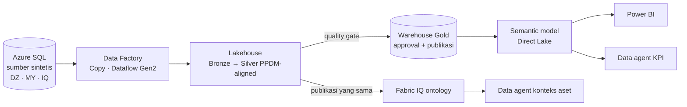

# Microsoft Fabric with PPDM Demo - PIEP Single Source of Truth

Materi demo dan workshop hands-on untuk membangun **Single Source of Truth (SSOT)** data produksi hulu bergaya **Pertamina Internasional EP (PIEP)** di **Microsoft Fabric**, dengan model data yang **disejajarkan dengan konsep PPDM** (*PPDM-aligned*).

> [!IMPORTANT]
> Semua data **sintetis**. Repositori ini tidak berisi data, aset, atau angka PIEP yang sebenarnya. Model data mengikuti konsep publik PPDM dan bukan salinan atau sertifikasi kepatuhan skema resmi PPDM.

## Isi repositori

| Dokumen | Isi |
|---|---|
| [PERTAMINA_PIEP_KONTEKS_BISNIS_DATA_DAN_FABRIC.md](PERTAMINA_PIEP_KONTEKS_BISNIS_DATA_DAN_FABRIC.md) | Konteks bisnis PIEP, tantangan data, dan relevansi Microsoft Fabric |
| [PPDM_DAN_RELEVANSINYA_UNTUK_PIEP.md](PPDM_DAN_RELEVANSINYA_UNTUK_PIEP.md) | Apa itu PPDM dan hubungannya dengan PIEP |
| [DEMO_PLAN_PIEP_PPDM_MICROSOFT_FABRIC_END_TO_END.md](DEMO_PLAN_PIEP_PPDM_MICROSOFT_FABRIC_END_TO_END.md) | Rencana demo end-to-end: use case, arsitektur, gate, pengujian, dan kurikulum |
| [demo tutorial/](demo%20tutorial/README.md) | **Workshop siap pakai**: overview, 14 lab bergaya Microsoft Learn, CLI Python, SQL, notebook, Dataflow, pipeline, DAX, ontology, data agent, dan kunci jawaban |

## Mulai dari mana?

1. **Ingin memahami konteks:** baca dokumen konteks PIEP dan PPDM di atas.
2. **Ingin menjalankan workshop:** buka [demo tutorial/README.md](demo%20tutorial/README.md), lalu [Overview](demo%20tutorial/tutorial/overview.md) dan [Lab 00](demo%20tutorial/tutorial/00-preflight.md).
3. **Fasilitator:** baca [facilitator-guide.md](demo%20tutorial/facilitator-guide.md) untuk agenda dua hari, checkpoint angka, dan waktu eksekusi terukur.

## Yang dibuktikan workshop

| Janji SSOT | Bukti |
|---|---|
| Satu identitas | Golden well ID dengan crosswalk alias sumber, hierarki well → wellbore → completion |
| Satu sumber berwenang | *Source authority register* memilih laporan final, laporan provisional tersimpan sebagai bukti |
| Satu definisi KPI | Measure DAX tunggal dipakai report dan data agent |
| Satu publikasi yang dapat ditelusuri | Quality gate, approval pemilik data, publikasi atomik, dan time travel |

Paket workshop sudah dijalankan **end-to-end di Azure dan Microsoft Fabric** untuk 10 batch skenario (baseline, revisi, duplikat, perubahan working interest, retraksi, data rusak, koreksi, dan konflik sumber). Semua total publikasi sama persis dengan kunci jawaban independen.

## Prasyarat singkat

- Microsoft Fabric dengan kapasitas F (data agent dan VNet data gateway membutuhkan kapasitas berbayar; F2+ untuk data agent).
- Subscription Azure untuk Azure SQL Database.
- Python 3.11+, Microsoft ODBC Driver 18, dan Azure CLI.

## Lisensi dan penafian

Materi ini dibuat untuk tujuan edukasi dan demo. Merek PPDM, Pertamina, dan Microsoft adalah milik pemiliknya masing-masing. Rujukan fakta publik dicantumkan pada setiap dokumen.
