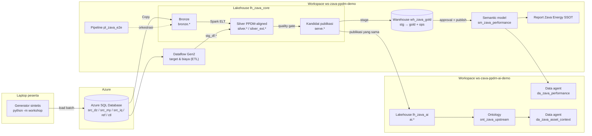
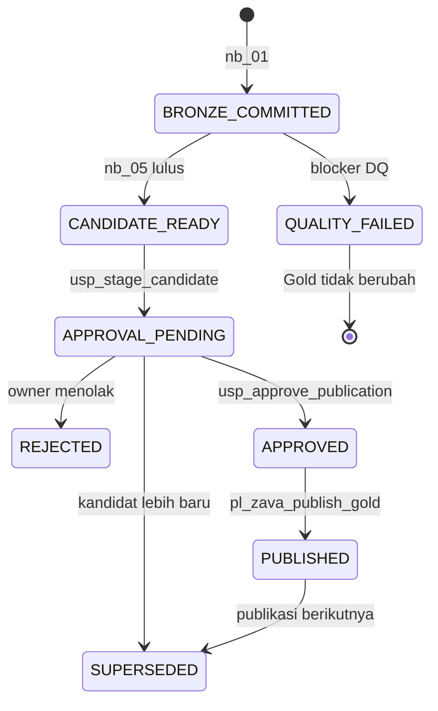

# Workshop: Zava Energy Single Source of Truth di Microsoft Fabric (PPDM-aligned)

Workshop hands-on ini membangun **satu versi kebenaran (Single Source of Truth, SSOT)** untuk data produksi hulu internasional milik perusahaan fiktif Zava Energy. Implementasinya end-to-end di Microsoft Fabric: Azure SQL sebagai sumber, Data Factory, Lakehouse medallion yang *PPDM-aligned*, Spark dan Dataflow Gen2, Warehouse Gold dengan approval bisnis, Power BI, Fabric IQ ontology, dan data agent.

> [!IMPORTANT]
> Semua data dalam workshop ini **sintetis**. Nama lapangan, sumur, operator, harga, dan biaya tidak mewakili aset atau angka Zava Energy yang sebenarnya.
>
> Model data ini **disejajarkan dengan konsep publik PPDM** dan bukan salinan skema resmi PPDM. Rencana desain lengkap ada di [DEMO_PLAN_ZAVA_ENERGY_PPDM_MICROSOFT_FABRIC_END_TO_END.md](../DEMO_PLAN_ZAVA_ENERGY_PPDM_MICROSOFT_FABRIC_END_TO_END.md).

## Apa yang akan Anda bangun



Setiap angka bisnis yang dilihat pengguna, baik di report, query SQL, maupun data agent, berasal dari **publikasi yang sama**, misalnya `PUB-S2`. Publikasi itu sudah lulus *quality gate* dan disetujui pemilik data.



## Daftar lab

Mulai dari **[Overview](tutorial/overview.md)** untuk memahami konteks bisnis, arsitektur, alur data, dan peta lab sebelum masuk ke langkah teknis.

| Lab | Judul | Durasi | Hasil |
|---|---|---:|---|
| [Overview](tutorial/overview.md) | Konteks, arsitektur, alur cerita data | 20 mnt | Paham tujuan dan alur workshop |
| [00](tutorial/00-preflight.md) | Preflight lingkungan | 45 mnt | Gate G0–G6 diperiksa, tool lokal siap |
| [01](tutorial/01-ssot-authority-ppdm-alignment.md) | Kontrak SSOT dan PPDM alignment | 60 mnt | Paham authority register, golden identity, KPI contract |
| [02](tutorial/02-synthetic-data-generator.md) | Generator data sintetis | 45 mnt | 10 paket batch dan kunci jawaban |
| [03](tutorial/03-azure-sql-source.md) | Azure SQL sebagai sumber | 60 mnt | Database sumber dengan batch B0 tersegel |
| [04](tutorial/04-copy-ingestion-bronze.md) | Ingestion Copy ke Bronze | 75 mnt | Bronze ter-commit dan teraudit |
| [05](tutorial/05-dataflow-gen2-etl.md) | ETL dengan Dataflow Gen2 | 60 mnt | `stg_df.target_monthly` dan `stg_df.cost_monthly` |
| [06](tutorial/06-spark-elt-silver.md) | ELT Spark ke Silver PPDM-aligned | 90 mnt | Golden record, keputusan otoritas sumber, quarantine |
| [07](tutorial/07-gold-warehouse-publication.md) | Gold Warehouse dan publikasi | 90 mnt | `PUB-B0` disetujui dan dipublikasikan |
| [08](tutorial/08-orchestration.md) | Orkestrasi dan pemulihan | 90 mnt | `pl_zava_e2e` dan `pl_zava_publish_gold` berjalan |
| [09](tutorial/09-semantic-model.md) | Semantic model Direct Lake | 75 mnt | `sm_zava_performance` tervalidasi terhadap SQL |
| [10](tutorial/10-power-bi-report.md) | Report Power BI | 90 mnt | Lima halaman dan satu drillthrough |
| [11](tutorial/11-ontology.md) | Fabric IQ ontology | 75 mnt | `ont_zava_upstream` dengan 13 entity type |
| [12](tutorial/12-data-agents.md) | Fabric data agents | 75 mnt | Dua agent dan 24 kasus evaluasi |
| [13](tutorial/13-ssot-proof-failure-drill.md) | Bukti SSOT dan failure drill | 60 mnt | Q1/Q2, S1/S2, time travel, konsistensi lintas kanal |

Total sekitar 16 jam, atau dua hari workshop. Agenda ringkas dan opsi percepatan ada di [facilitator-guide.md](facilitator-guide.md).

## Struktur folder

```text
demo tutorial/
├── README.md                     ← halaman ini
├── tutorial/                     ← overview + 14 lab (00-13)
├── facilitator-guide.md · troubleshooting.md · cleanup.md
├── workshop/                     ← CLI Python: generate, load, render, deploy, evaluate
├── config/workshop.example.json  ← salin ke config/local.json
├── infra/azure-sql/              ← Bicep Azure SQL (Entra-only) + opsi jaringan privat
├── assets/
│   ├── sql/azure-sql/            ← skema sumber, role, validasi
│   ├── sql/warehouse/            ← objek Gold, prosedur publikasi, validasi, time travel
│   ├── fabric/notebooks/         ← nb_00-nb_06 (.ipynb siap impor; sumber di src/)
│   ├── fabric/dataflows/         ← skrip Power Query M
│   ├── fabric/pipelines/         ← lembar aktivitas + definisi JSON pipeline yang sudah diuji
│   ├── contracts/                ← authority register, PPDM alignment, DQ rules, KPI, data product
│   ├── powerbi/                  ← measure DAX, query validasi, tema, spesifikasi report
│   ├── ontology/                 ← entity type dan relationship type
│   ├── agents/                   ← instruksi agent & sumber data, contoh query, 24 kasus evaluasi
│   └── expected/                 ← kunci jawaban independen (standard dan small)
└── tests/                        ← uji otomatis aset dan notebook (Spark lokal)
```

## Mulai cepat

```powershell
cd "demo tutorial"
python -m venv .venv
.\.venv\Scripts\Activate.ps1
pip install -r requirements-azure.txt
python -m workshop generate --profile standard
```

Baca [Overview](tutorial/overview.md), lalu lanjutkan ke [Lab 00 - Preflight](tutorial/00-preflight.md).

## Perintah CLI `python -m workshop`

| Perintah | Fungsi | Dipakai di |
|---|---|---|
| `generate --profile standard` | Membuat 10 paket batch sintetis (CSV) | Lab 02 |
| `expected --profile standard` | Menulis kunci jawaban independen | Lab 02 |
| `run-sql --config ... --file ...` | Menjalankan skrip T-SQL (pemisah `GO`) ke Azure SQL | Lab 03 |
| `load --config ... --batch B0` / `--through S2` | Memuat dan menyegel batch dalam satu transaksi | Lab 03, 08, 13 |
| `verify` · `status` | Rekonsiliasi jumlah baris dan status batch sumber | Lab 03 |
| `deploy-pipelines --config ...` | Membuat/memperbarui `pl_zava_setup_source`, `pl_zava_load_source`, `pl_zava_e2e`, `pl_zava_publish_gold` (memakai `az login`) | Lab 03 opsi B, 08 |
| `evaluate-agents --config ... --rounds 3` | Menjalankan 24 kasus evaluasi ke data agent yang sudah dipublikasikan | Lab 13 |
| `render-sql` · `render-warehouse` · `render-contracts` · `render-pipelines` · `build-notebooks` | Membuat ulang aset turunan dari sumber tunggalnya | Fasilitator |

Autentikasi Azure SQL memakai Microsoft Entra ID: `ActiveDirectoryInteractive` (popup login) atau `AzureCli` (token `az login`). Tidak ada password di konfigurasi.

## Dua jalur jaringan

| Opsi | Kapan | Cara memuat sumber |
|---|---|---|
| **A - endpoint publik** | Tenant mengizinkan akses publik Azure SQL | `python -m workshop load` dari laptop |
| **B - jaringan privat** | Kebijakan organisasi menonaktifkan akses publik | VNet data gateway + private endpoint ([`private-network.bicep`](infra/azure-sql/private-network.bicep)), lalu pipeline `pl_zava_load_source` |

Lihat [Lab 03](tutorial/03-azure-sql-source.md#opsi-b---jaringan-privat-tanpa-endpoint-publik).

## Status validasi

Paket ini sudah dijalankan **end-to-end di Azure dan Microsoft Fabric** (kapasitas F8, opsi B) untuk ke-10 batch B0–S2:

| Area | Hasil |
|---|---|
| Sumber, Copy, Dataflow Gen2, notebook Spark, Warehouse | Semua total publikasi sama persis dengan [kunci jawaban](assets/expected/expected-results-standard.json) |
| Gate | F1 pulih tanpa duplikasi Bronze; Q1 diblokir (35 blocker) dan Gold tetap `PUB-X1`; S2 hanya berlaku setelah approval (+5 BOE gross, +2 BOE net WI) |
| Konsumsi | DAX = SQL; time travel mereproduksi tiap publikasi; graph walk ontology benar; data agent 23/24 kasus benar dan 1 parsial |
| Belum diuji otomatis | Pembuatan report Power BI di UI (Lab 10) dan langkah UI ontology/agent; ketiganya diuji lewat API dengan aset yang sama |

Pemeriksaan lokal:

```powershell
pip install -r requirements-test.txt
python -m pytest -m "not spark"   # aset, kontrak, link, angka tutorial
python -m pytest -m spark         # opsional: notebook Fabric di Spark 3.5 + Delta lokal
```

Lihat [tests/README.md](tests/README.md).

## Konvensi

- **Nama item Fabric** mengikuti rencana demo: `lh_zava_core`, `wh_zava_gold`, `sm_zava_performance`, `ont_zava_upstream`, `da_zava_performance`, dan `da_zava_asset_context`.
- **Kolom Silver** memakai `snake_case`; **kolom Gold** memakai `PascalCase`; **tabel AI** memakai `snake_case`.
- **ID publikasi** memakai format `PUB-<batch>`. Gold, semantic model, dan tabel AI selalu membawa ID publikasi yang sama.
- **Bahasa** instruksi dan pertanyaan data agent adalah bahasa Inggris, karena data agent saat ini hanya mendukung bahasa Inggris.

## Referensi utama

- [Microsoft Fabric documentation](https://learn.microsoft.com/fabric/)
- [Implement medallion lakehouse architecture in Microsoft Fabric](https://learn.microsoft.com/fabric/onelake/onelake-medallion-lakehouse-architecture)
- [What is data warehousing in Microsoft Fabric?](https://learn.microsoft.com/fabric/data-warehouse/data-warehousing)
- [Direct Lake overview](https://learn.microsoft.com/fabric/fundamentals/direct-lake-overview)
- [Fabric data agent concepts](https://learn.microsoft.com/fabric/data-science/concept-data-agent)
- [PPDM Association](https://ppdm.org/)
