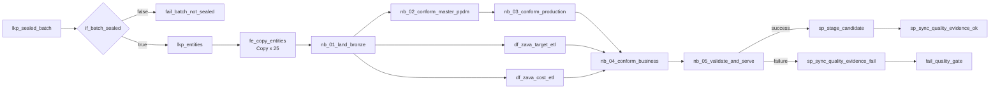
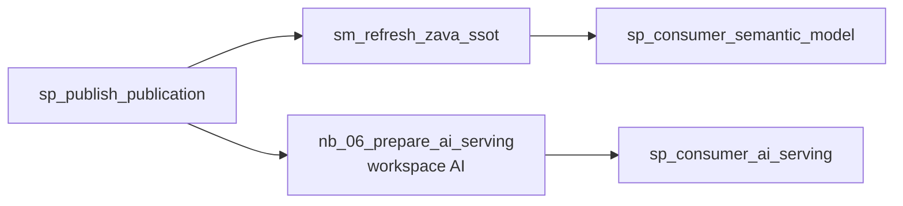

# Lembar aktivitas pipeline (copy-paste)

Lembar ini dipakai di Lab 08 (`pl_zava_e2e` dan versi awal `pl_zava_publish_gold`), lalu dilengkapi di Lab 09 (refresh semantic model) dan Lab 11 (serving AI). Salin setiap ekspresi apa adanya melalui **Add dynamic content**.

Definisi JSON yang sudah dijalankan berhasil di Fabric tersedia di [`definitions/`](definitions/). Definisi tersebut mencakup `pl_zava_e2e`, `pl_zava_publish_gold`, dan dua pipeline opsi B (`pl_zava_setup_source`, `pl_zava_load_source`). ID item ditulis sebagai placeholder `<...>`; `python -m workshop deploy-pipelines` mengisinya otomatis berdasarkan nama.

## Koneksi yang dibutuhkan

| Nama koneksi | Tipe | Autentikasi | Dipakai oleh |
|---|---|---|---|
| `conn_sql_zava_source` | Azure SQL Database | Organizational account (OAuth2) atau Service principal (khusus Copy/Lookup) | Lookup, Copy, Dataflow Gen2 (organizational account) |
| Lakehouse `lh_zava_core` | Item Fabric | Identitas pengguna | Copy (destination), Notebook |
| Warehouse `wh_zava_gold` | Item Fabric | Identitas pengguna | Stored procedure |

## `pl_zava_e2e` - dari sumber ke kandidat publikasi

**Parameter pipeline**

| Nama | Tipe | Default |
|---|---|---|
| `p_batch_id` | String | `B0` |
| `p_fail_after_bronze` | String | `false` |

| # | Nama aktivitas | Tipe | Pengaturan utama | Bergantung pada |
|---|---|---|---|---|
| 1 | `lkp_sealed_batch` | Lookup | Koneksi `conn_sql_zava_source`; **Use query** = Query; **First row only** = ✅; query = E1 | - |
| 2 | `if_batch_sealed` | If Condition | Expression = E2; *False*: aktivitas **Fail** `fail_batch_not_sealed`, message = E3, error code `BATCH_NOT_SEALED` | 1 (Success) |
| 3 | `lkp_entities` | Lookup | Query = E4; **First row only** = ❌ | 2 (Success) |
| 4 | `fe_copy_entities` | ForEach | **Items** = E5; **Sequential** = ❌; **Batch count** = 8 | 3 (Success) |
| 4a | `cp_entity_to_landing` (di dalam ForEach) | Copy data | Source: `conn_sql_zava_source`, **Use query** = Query, query = E6. Destination: Lakehouse `lh_zava_core`, **Root folder** = Files, **Folder path** = E7, **File name** = E8, **File format** = Parquet | - |
| 5 | `nb_01_land_bronze` | Notebook | Notebook `nb_01_land_bronze`; base parameters: `p_batch_id` (String) = E9, `p_run_id` (String) = E10 | 4 (Success) |
| 6 | `nb_02_conform_master_ppdm` | Notebook | Parameter E9, E10, dan `p_fail_after_bronze` (String) = E11 | 5 (Success) |
| 7 | `nb_03_conform_production` | Notebook | Parameter E9, E10 | 6 (Success) |
| 8 | `df_zava_target_etl` | Dataflow | Dataflow `df_zava_target_etl`; **Dataflow parameters**: `pBatchId` (Text) = E9 | 5 (Success) |
| 9 | `df_zava_cost_etl` | Dataflow | Dataflow `df_zava_cost_etl`; `pBatchId` = E9 | 5 (Success) |
| 10 | `nb_04_conform_business` | Notebook | Parameter E9, E10 | 7, 8, 9 (Success) |
| 11 | `nb_05_validate_and_serve` | Notebook | Parameter E9, E10 | 10 (Success) |
| 12 | `sp_stage_candidate` | Stored procedure | Warehouse `wh_zava_gold`; procedure `ops.usp_stage_candidate`; `PublicationId` = E12, `RunId` = E10; **Retry** = 3, **Retry interval** = 120 detik | 11 (Success) |
| 13 | `sp_sync_quality_evidence_ok` | Stored procedure | `ops.usp_sync_quality_evidence`; `BatchId` = E9, `RunId` = E10 | 12 (Success) |
| 14 | `sp_sync_quality_evidence_fail` | Stored procedure | Sama dengan #13 | 11 (**Fail**) |
| 15 | `fail_quality_gate` | Fail | Message = E13; error code `QUALITY_GATE` | 14 (Completion) |

> [!NOTE]
> Retry pada `sp_stage_candidate` menangani jeda sinkronisasi metadata SQL analytics endpoint. Prosedur akan melempar error 50011 sampai jumlah baris di endpoint sama dengan manifest `serve.publication_row_count`.

### Ekspresi

| ID | Ekspresi |
|---|---|
| E1 | `@concat('SELECT batch_id, period_end, content_sha256 FROM ctl.source_batch WHERE state = ''SEALED'' AND batch_id = ''', pipeline().parameters.p_batch_id, '''')` |
| E2 | `@contains(activity('lkp_sealed_batch').output, 'firstRow')` |
| E3 | `@concat('Batch ', pipeline().parameters.p_batch_id, ' is not SEALED in ctl.source_batch. Load it with python -m workshop load first.')` |
| E4 | `SELECT entity_name, source_schema, source_table FROM ctl.entity_config WHERE enabled = 1 ORDER BY ordinal` |
| E5 | `@activity('lkp_entities').output.value` |
| E6 | `@concat('SELECT * FROM [', item().source_schema, '].[', item().source_table, '] WHERE batch_id = ''', pipeline().parameters.p_batch_id, '''')` |
| E7 | `@concat('landing/', pipeline().parameters.p_batch_id, '/', item().entity_name)` |
| E8 | `@concat(item().entity_name, '.parquet')` |
| E9 | `@pipeline().parameters.p_batch_id` |
| E10 | `@pipeline().RunId` |
| E11 | `@pipeline().parameters.p_fail_after_bronze` |
| E12 | `@concat('PUB-', pipeline().parameters.p_batch_id)` |
| E13 | `@concat('Batch ', pipeline().parameters.p_batch_id, ' failed the SSOT quality gate. Gold is unchanged. Check ops.quality_evidence and ops.dq_issue_summary in wh_zava_gold.')` |

## `pl_zava_publish_gold` - publikasi setelah approval bisnis

Jalankan **hanya setelah** pemilik data menjalankan `EXEC ops.usp_approve_publication 'PUB-<batch>';` di `wh_zava_gold`.

**Parameter pipeline:** `p_publication_id` (String), default `PUB-B0`.

| # | Nama aktivitas | Tipe | Pengaturan utama | Bergantung pada | Ditambahkan di |
|---|---|---|---|---|---|
| 1 | `sp_publish_publication` | Stored procedure | `ops.usp_publish_publication`; `PublicationId` = P1, `RunId` = E10 | - | Lab 08 |
| 2 | `sm_refresh_zava_performance` | Semantic model refresh | Koneksi **Power BI semantic model** (OAuth 2.0); workspace `ws-zava-ppdm-demo`, semantic model `sm_zava_performance`; **Wait on completion** = ✅ | 1 (Success) | Lab 09 |
| 3 | `sp_consumer_semantic_model` | Stored procedure | `ops.usp_record_consumer_status`; `PublicationId` = P1, `Consumer` = `SEMANTIC_MODEL`, `Status` = `REFRESHED` | 2 (Success) | Lab 09 |
| 4 | `nb_06_prepare_ai_serving` | Notebook | **Workspace** `ws-zava-ppdm-ai-demo`, notebook `nb_06_prepare_ai_serving`; `p_publication_id` = P1, `p_run_id` = E10, `p_source_prefix` = `` `ws-zava-ppdm-demo`.`lh_zava_core`.`serve` `` | 1 (Success) | Lab 11 |
| 5 | `sp_consumer_ai_serving` | Stored procedure | `ops.usp_record_consumer_status`; `PublicationId` = P1, `Consumer` = `AI_SERVING`, `Status` = `READY` | 4 (Success) | Lab 11 |

| ID | Ekspresi |
|---|---|
| P1 | `@pipeline().parameters.p_publication_id` |

> [!IMPORTANT]
> Setelah `pl_zava_publish_gold` berhasil, refresh ontology secara manual karena binding ontology tidak ter-refresh otomatis. Lalu jalankan evaluasi data agent (Lab 13).
