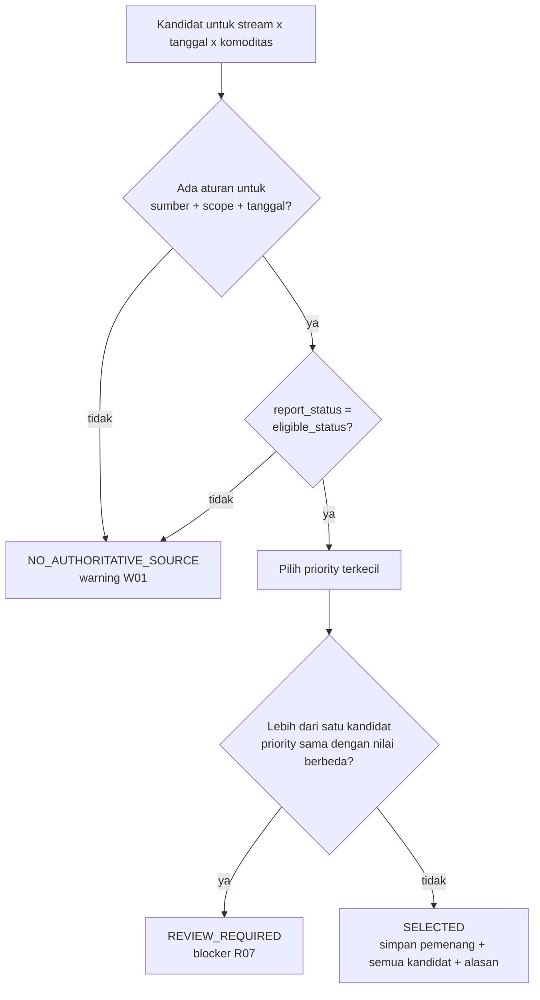
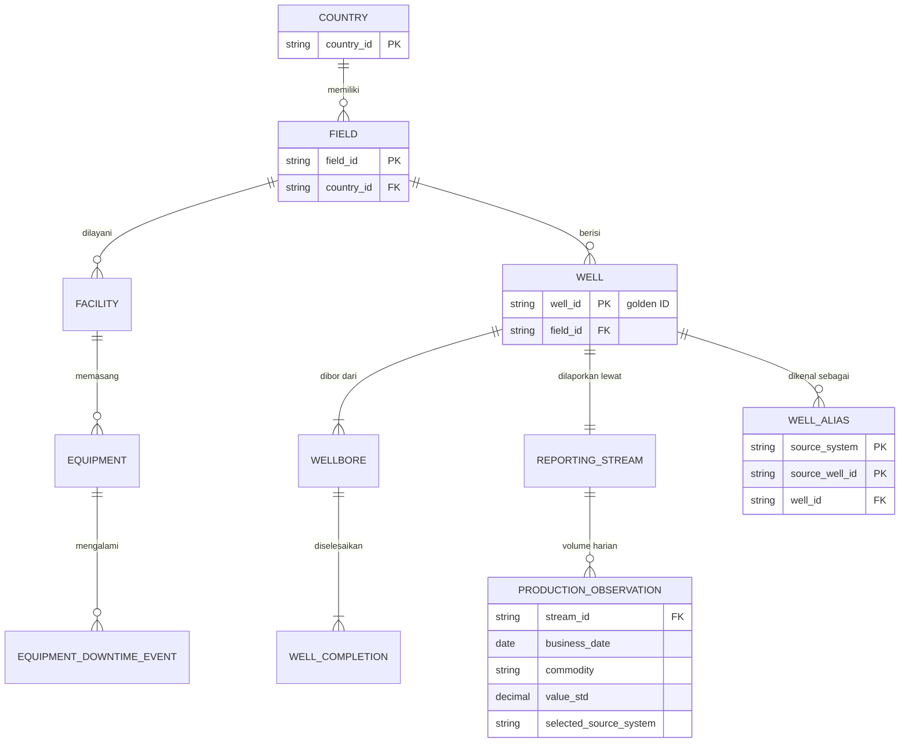

# Lab 01 - Kontrak SSOT dan PPDM alignment

SSOT bukan sekadar menaruh semua data di OneLake. SSOT adalah kesepakatan tentang **sumber mana yang berwenang**, **identitas objek mana yang menjadi golden record**, **bagaimana KPI dihitung**, dan **siapa yang menyetujui publikasi**. Lab ini membedah kontrak yang menggerakkan seluruh pipeline workshop. Semua kontrak disimpan sebagai file CSV yang dapat ditinjau.

Dalam lab ini Anda akan:

- [ ] Memahami source authority register dan cara memilih satu angka berwenang.
- [ ] Memahami golden identity dan crosswalk alias sumber dengan konsep PPDM *well → wellbore → completion*.
- [ ] Meninjau PPDM alignment register, aturan kualitas data, kontrak KPI, dan data product.

## Prasyarat

- [Lab 00](00-preflight.md) selesai.
- Pengetahuan dasar tentang PPDM. Lihat [PPDM Association](https://ppdm.org/).

## 1. Pahami masalah yang diselesaikan SSOT

Zava Energy mengoperasikan aset di beberapa negara. Setiap negara memiliki sistem pelaporan dengan nama kolom, satuan, dan ID sumur berbeda. Dalam workshop ini tiga negara sintetis mewakili pola tersebut:

| Sumber | Negara | Ciri khas | Status yang diterima |
|---|---|---|---|
| `SRC_DZ_PROD` | Aljazair (DZ) | Minyak dan air dalam **m³** | `FINAL` |
| `SRC_MY_PROD` | Malaysia (MY) | Satuan standar (bbl, Mscf) | `FINAL` |
| `SRC_MY_OPS` | Malaysia (MY) | Laporan operasi harian **provisional**; ID sumur gaya `MYB001` | Tidak pernah berwenang |
| `SRC_IQ_PROD` | Irak (IQ) | Gas dalam **scf**; nama kolom lokal (`well_code`, `qty`, `approval_flag`) | `FINAL` (`approval_flag = Y`) |

Tanpa kontrak, dua laporan untuk sumur dan tanggal yang sama dapat menghasilkan dua angka produksi. SSOT memastikan **satu angka berwenang**, beserta alasan pemilihannya.

## 2. Tinjau source authority register

Buka [`assets/contracts/source_authority_register.csv`](../assets/contracts/source_authority_register.csv).

Hal yang perlu diperhatikan:

- Prioritas berlaku **per domain dan scope**, bukan satu angka global.
- `SRC_MY_OPS` memiliki `eligible_status = NONE` dan priority 99. Laporan provisional disimpan sebagai pembanding, tetapi tidak pernah menjadi angka resmi.
- Setiap keputusan disimpan di `ops.source_decision`, lalu di `gold.source_decision`, lengkap dengan `candidates_json`. Auditor dapat melihat semua kandidat, bukan hanya pemenangnya.

## 3. Pahami golden identity dan PPDM alignment

PPDM membedakan *well*, *wellbore*, dan *completion*. Workshop ini mengikuti konsep tersebut dan menambahkan *reporting stream* sebagai unit pelaporan produksi.

Contoh crosswalk untuk satu sumur:

| `source_system` | `source_well_id` | Golden `well_id` |
|---|---|---|
| `SRC_MY_PROD` | ID lokal sistem final | `MY_B_W001` |
| `SRC_MY_OPS` | `MYB001` | `MY_B_W001` |

Buka [`assets/contracts/ppdm_alignment_register.csv`](../assets/contracts/ppdm_alignment_register.csv). Setiap tabel Silver memiliki salah satu status berikut:

| Status | Arti |
|---|---|
| `ALIGNED_TO_PUBLIC_CONCEPT` | Mengikuti konsep PPDM yang terdokumentasi publik, misalnya *What Is A Well?* dan hierarki well/wellbore/completion |
| `DEMO_EXTENSION` | Kebutuhan bisnis demo seperti working interest sederhana, target RKAP, biaya, dan source authority |
| `REQUIRES_DOMAIN_VALIDATION` | Perlu validasi pakar domain sebelum produksi, misalnya klasifikasi downtime |

> [!NOTE]
> Register ini membuat batas klaim tetap jujur. Workshop **tidak** mengklaim mengimplementasikan PPDM 3.9 secara penuh. Penggunaan DDL resmi PPDM adalah jalur lanjutan dengan hak akses dan lisensi tersendiri.

## 4. Tinjau aturan kualitas data dan quality gate

Buka [`assets/contracts/dq_rules.csv`](../assets/contracts/dq_rules.csv).

- **BLOCKER** (M01–M04, R01–R07, B01–B05) menghentikan publikasi. Batch berstatus `QUALITY_FAILED` dan Gold tetap memakai publikasi terakhir yang disetujui.
- **WARNING** (W01) dan **INFO** (R10, duplikat identik) dicatat sebagai bukti, tetapi tidak menghentikan publikasi.

## 5. Tinjau kontrak KPI dan data product

1. Buka [`assets/contracts/kpi_contract.csv`](../assets/contracts/kpi_contract.csv). Perhatikan definisi berikut:
   - **Gross BOE** = oil (bbl) + gas (Mscf) / 6. Faktor 6 berasal dari registry satuan `ref.uom_conversion`, bukan angka hard-coded di report.
   - **Net WI BOE** = gross × working interest yang berlaku pada tanggal bisnis. Ini *bukan* entitlement fiskal.
   - **Data Completeness %** = stream-day dengan oil, gas, dan water lengkap dibagi semua stream-day.
2. Buka [`assets/contracts/data_products.csv`](../assets/contracts/data_products.csv). Setiap data product memiliki pemilik domain dan aturan refresh *per approved publication*.

## 6. Latihan diskusi (10 menit)

Jawab dalam kelompok:

1. Pada 2025-09-20, `SRC_MY_OPS` melaporkan 294,014547 bbl untuk `MY_B_W001`, sedangkan `SRC_MY_PROD` final melaporkan 284,014547 bbl. Angka mana yang masuk Gold, dan mengapa?
2. Mengapa laporan Malaysia yang memakai ID `MYB001` tidak membuat sumur baru?
3. Siapa yang boleh mengubah prioritas di register authority, dan bagaimana perubahannya dicatat?

Kunci jawaban

1. **284,014547 bbl** dari `SRC_MY_PROD`. Hanya status `FINAL` dari sumber priority 1 yang memenuhi syarat. Nilai provisional tetap tersimpan di `candidates_json`.
2. Karena crosswalk `ref.well_alias` memetakan `SRC_MY_OPS:MYB001` ke golden ID `MY_B_W001`.
3. Pemilik domain (*production reporting owner*) melalui perubahan `policy_version`, misalnya `SA-2025.1` → `SA-2025.2`. Setiap publikasi mencatat `AuthorityPolicyVersion`.

## Verifikasi

Anda dapat menjelaskan dengan kata-kata sendiri:

- empat gate sebelum publikasi: quality, authority, reconciliation, dan approval;
- perbedaan well, wellbore, completion, dan reporting stream;
- mengapa ID publikasi wajib tampil di setiap kanal konsumsi.

## Langkah berikutnya

**Lanjut ke:** [Lab 02 - Generator data sintetis](02-synthetic-data-generator.md) →

## Referensi

- [PPDM - What Is A Well? components](https://whatisawell.ppdm.org/components)
- [PPDM 3.9 Data Model](https://ppdm.org/ppdm/PPDM/IEDS/PPDM_Data_Model/PPDM/PPDM_3.9_Data_Model.aspx)
- [PPDM Data Rules](https://ppdm.org/ppdm/PPDM/IPDS/Data_Rules/PPDM/Data_Rules.aspx?hkey=cf530f4d-67a5-4997-afc2-4252811df4db)
- [Fabric domains](https://learn.microsoft.com/fabric/governance/domains)
- [Implement medallion lakehouse architecture in Microsoft Fabric](https://learn.microsoft.com/fabric/onelake/onelake-medallion-lakehouse-architecture)
