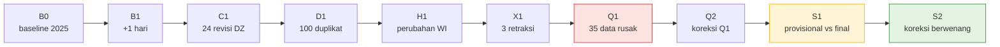

# Lab 02 - Generator data sintetis dan kunci jawaban

Workshop membutuhkan data yang **realistis tetapi sepenuhnya sintetis**, sekaligus **deterministik**: seed yang sama selalu menghasilkan angka yang sama. Dengan begitu setiap peserta dapat mencocokkan hasilnya dengan kunci jawaban. Generator berjalan di laptop dan menulis file CSV. Data baru masuk ke Azure SQL di Lab 03, sehingga Fabric selalu membaca dari sumber, bukan dari output generator.

Dalam lab ini Anda akan:

- [ ] Menghasilkan 10 paket batch (`B0` sampai `S2`) dengan profil `standard`.
- [ ] Memahami isi setiap paket dan perubahan bisnis yang diwakilinya.
- [ ] Membaca kunci jawaban independen (`expected-results-standard.json`).

## Prasyarat

- [Lab 00](00-preflight.md) selesai dan virtual environment Python aktif.

## 1. Jalankan generator

```powershell
cd "demo tutorial"
.\.venv\Scripts\Activate.ps1
python -m workshop generate --profile standard
```

Generator menulis folder `data/source/<batch>/` berisi satu CSV per tabel sumber, ditambah `data/source/index.json`. Proses ini hanya memerlukan beberapa detik.

> [!NOTE]
> Seed tetap `20261005`. Jika file sudah ada dengan isi berbeda, generator berhenti dan **tidak menimpa** file. Ini menjaga paket batch tetap *immutable*.

## 2. Pahami paket batch

Paket bersifat **linear dan kumulatif**: setiap batch diterapkan di atas batch sebelumnya. Tabel `ref.*` adalah *snapshot* lengkap per batch, sedangkan tabel event (`src_*`) hanya berisi **delta**.



| Batch | Isi delta event | Skenario bisnis | Hasil yang diharapkan |
|---|---|---|---|
| `B0` | 3 × 43.800 laporan produksi, 200 downtime event, 40 loss allocation | Baseline 1 Jan–31 Des 2025, termasuk insiden INC-MY-001 | `PUB-B0` dapat disetujui |
| `B1` | 3 × 120 laporan untuk 2026-01-01 | Tambahan satu hari | Fakta 43.920 baris |
| `C1` | 24 revisi `SRC_DZ_PROD` | Revisi berwenang (rev 2) | Total DZ berubah |
| `D1` | 100 duplikat identik `SRC_IQ_PROD` | Pengiriman ulang | INFO R10 = 100; tidak ada dobel hitung |
| `H1` | Hanya snapshot `ref.working_interest` | WI `DZ_A` berubah mulai 2025-07-01 | Net WI DZ turun, gross tetap |
| `X1` | 3 retraksi minyak `SRC_MY_PROD` | Sumber membatalkan laporan | 3 stream-day tidak lengkap |
| `Q1` | 35 revisi rusak | Satuan salah (R02 = 20), alias tak dikenal (R01 = 10), kuantitas kosong (R03 = 5) | **`QUALITY_FAILED`**; Gold tetap `PUB-X1` |
| `Q2` | 35 koreksi | Perbaikan oleh sumber | Lulus; total kembali sama dengan X1 |
| `S1` | 1 laporan `SRC_MY_OPS` provisional | Nilai provisional 294,014547 bbl berbeda dari final | Final 284,014547 bbl tetap dipilih |
| `S2` | 1 revisi final `SRC_MY_PROD` | Koreksi berwenang 289,014547 bbl | +5 BOE gross, +2 BOE net WI |

> [!NOTE]
> `H1` dan `X1` sengaja ditempatkan sebelum drill kualitas `Q1`/`Q2`, sehingga keduanya dapat dijalankan sebagai batch *express* di latar belakang saat Lab 10.

## 3. Tinjau ukuran dan fixture

Buka `data/source/index.json` untuk melihat jumlah baris per tabel. Angka penting untuk `B0`:

| Objek | Jumlah |
|---|---:|
| Negara / field / facility / equipment | 3 / 6 / 6 / 36 |
| Well / wellbore / completion / reporting stream | 120 / 150 / 180 / 120 |
| Alias sumur | 160 (120 sumber final + 40 `SRC_MY_OPS`) |
| Observasi produksi | 131.400 |
| Downtime event | 200 (4 di antaranya insiden INC-MY-001) |
| Loss allocation INC-MY-001 | 40 (10 sumur × 4 hari) |

## 4. Baca kunci jawaban

Kunci jawaban dihitung oleh [`workshop/expected.py`](../workshop/expected.py). Modul ini adalah implementasi Python murni dari aturan SSOT dan **tidak berbagi kode** dengan notebook Spark, sehingga kesalahan logika di notebook tidak ikut tersalin ke kunci jawaban.

```powershell
python -m workshop expected --profile standard
```

Buka [`assets/expected/expected-results-standard.json`](../assets/expected/expected-results-standard.json) dan cari nilai berikut:

| Kunci | Nilai |
|---|---|
| `publications.PUB-B0.totals.gross_boe_total` | 23840575.796184 |
| `publications.PUB-B0.totals.net_wi_boe_total` | 9429006.223961 |
| `publications.PUB-Q1.status` | `QUALITY_FAILED` |
| `publications.PUB-S2.totals.gross_boe_total` | 23901264.782757 |
| `fixture.lost_boe_gross` / `fixture.lost_boe_net_wi` | 4000.000000 / 1600.000000 |
| `fixture.value_usd_gross` | 177080.0000 |
| `ssot_checks.s1_selected_oil_bbl` / `s2_selected_oil_bbl` | 284.014547 / 289.014547 |

> [!TIP]
> Simpan tab file ini. Hampir setiap lab berikutnya memiliki langkah verifikasi yang merujuk ke nilai di atas.

## Verifikasi

- Folder `data/source` berisi 10 subfolder `B0` sampai `S2`, masing-masing dengan 25 file CSV.
- Menjalankan ulang `python -m workshop generate --profile standard` selesai tanpa error dan tanpa mengubah file.

## Pemecahan masalah

| Gejala | Solusi |
|---|---|
| `FileExistsError ... exists with different content` | Anda mengubah CSV secara manual atau memakai seed lain. Hapus folder `data/source` lalu generate ulang. |
| Ingin data lebih kecil untuk uji cepat | Gunakan `--profile small` (60 sumur, September 2025) dengan folder output berbeda: `--output data/source-small`. |

## Langkah berikutnya

> [!div class="nextstepaction"]
> [Lab 03 - Azure SQL sebagai sumber](03-azure-sql-source.md)

## Referensi

- [Lakehouse end-to-end scenario tutorial (pola tutorial Microsoft Learn)](https://learn.microsoft.com/fabric/data-engineering/tutorial-lakehouse-introduction)
- Rencana demo, bagian 5: [Data dummy dan generator](../../DEMO_PLAN_ZAVA_ENERGY_PPDM_MICROSOFT_FABRIC_END_TO_END.md#5-data-dummy-dan-generator)
