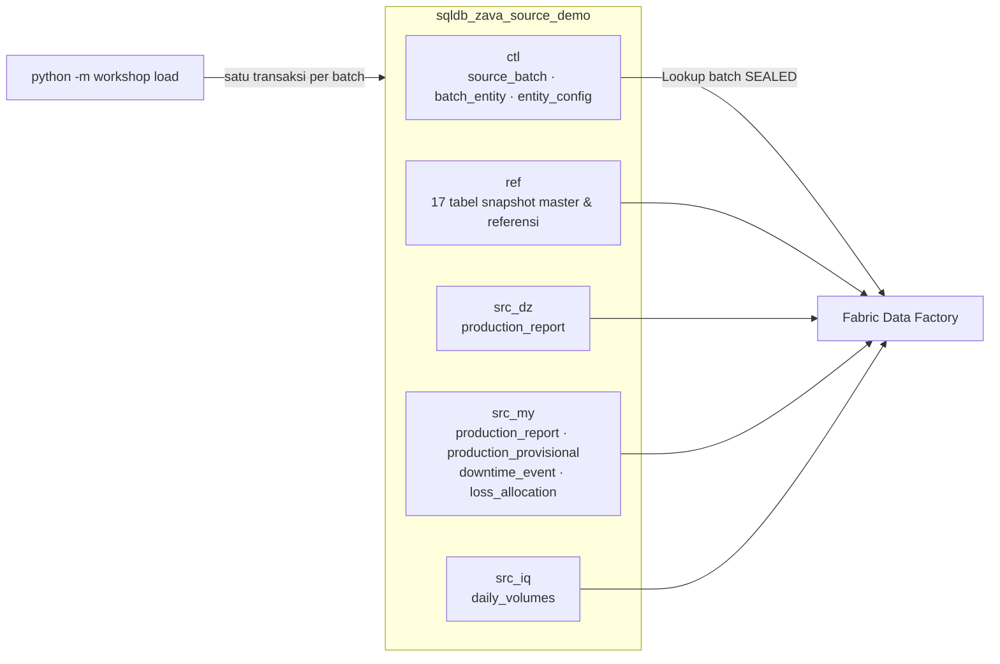
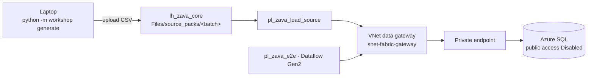

# Lab 03 - Azure SQL Database sebagai sistem sumber

Dalam skenario nyata, data Zava Energy berasal dari sistem pelaporan operator di tiap negara. Workshop ini menyimulasikannya dengan satu **Azure SQL Database** berisi schema per sumber (`src_dz`, `src_my`, `src_iq`), data referensi (`ref`), dan kontrol batch (`ctl`). Database hanya memakai autentikasi **Microsoft Entra ID**, tanpa SQL login atau password.

Dalam lab ini Anda akan:

- [ ] Men-deploy Azure SQL Database serverless dengan Bicep (Entra-only, TLS 1.2).
- [ ] Membuat schema sumber dan konfigurasi entitas untuk ingestion berbasis metadata.
- [ ] Memuat batch `B0` dalam satu transaksi dan menyegelnya (`SEALED`).
- [ ] Merekonsiliasi jumlah baris terhadap manifest batch.

## Prasyarat

- [Lab 02](02-synthetic-data-generator.md) selesai: folder `data/source` sudah ada.
- Peran **Contributor** pada resource group `rg-zava-ppdm-demo`.

## Arsitektur sumber



## 1. Deploy Azure SQL dengan Bicep

1. Masuk ke Azure dan pilih subscription workshop:

   ```powershell
   az login
   az account set --subscription "<SUBSCRIPTION_ID>"
   ```

2. Buat resource group. Lewati langkah ini jika fasilitator sudah membuatnya.

   ```powershell
   az group create --name rg-zava-ppdm-demo --location <REGION_KAPASITAS_FABRIC> --tags workload=zava-ssot-workshop dataClassification=synthetic
   ```

3. Ambil identitas Anda dan IP publik laptop:

   ```powershell
   $upn = az ad signed-in-user show --query userPrincipalName -o tsv
   $oid = az ad signed-in-user show --query id -o tsv
   $ip  = (Invoke-RestMethod https://api.ipify.org)
   ```

4. Deploy template. Ganti `<inisial>` dengan inisial Anda agar nama server unik.

   ```powershell
   az deployment group create `
     --resource-group rg-zava-ppdm-demo `
     --template-file infra/azure-sql/main.bicep `
     --parameters serverName=sql-zava-ssot-<inisial> entraAdminLogin=$upn entraAdminObjectId=$oid clientIpAddress=$ip allowAzureServices=true `
     --query properties.outputs
   ```

   Output menampilkan `serverFqdn`, misalnya `sql-zava-ssot-abc.database.windows.net`.

> [!IMPORTANT]
> `allowAzureServices=true` membuka firewall untuk **semua** layanan Azure, termasuk tenant lain. Pengaturan ini dipakai agar koneksi cloud Fabric dapat menjangkau database **sintetis** ini dengan sederhana. Untuk data nyata, gunakan [VNet data gateway](https://learn.microsoft.com/data-integration/vnet/overview) atau private endpoint dan biarkan nilainya `false`.

Template menerapkan kontrol berikut:

| Kontrol | Nilai |
|---|---|
| Autentikasi | `azureADOnlyAuthentication: true`, tanpa `administratorLogin` |
| TLS minimum | 1.2 |
| SKU | General Purpose serverless `GP_S_Gen5`, maksimum 2 vCore, auto-pause 60 menit |
| Tag | `workload`, `dataClassification=synthetic`, `owner` |

> [!IMPORTANT]
> **Periksa kebijakan organisasi.** Banyak tenant korporat memasang Azure Policy yang memaksa *public network access* Azure SQL menjadi `Disabled`. Jika deployment gagal dengan `DenyPublicEndpointEnabled`, atau `az sql server show ... --query publicNetworkAccess` tetap `Disabled`, gunakan [Opsi B - jaringan privat](#opsi-b---jaringan-privat-tanpa-endpoint-publik). Jangan meminta pengecualian kebijakan hanya untuk demo.

## Opsi B - jaringan privat tanpa endpoint publik

Gunakan opsi ini bila endpoint publik Azure SQL dilarang. Fabric menjangkau database melalui **VNet data gateway**, dan data dimuat dengan pipeline Fabric, bukan dari laptop. Jalur ini sudah diuji end-to-end.



1. Deploy database tanpa endpoint publik, lalu deploy VNet, private endpoint, dan private DNS:

   ```powershell
   az deployment group create -g rg-zava-ppdm-demo --template-file infra/azure-sql/main.bicep `
     --parameters serverName=sql-zava-ssot-<inisial> entraAdminLogin=$upn entraAdminObjectId=$oid publicNetworkAccess=Disabled
   az deployment group create -g rg-zava-ppdm-demo --template-file infra/azure-sql/private-network.bicep `
     --parameters serverName=sql-zava-ssot-<inisial>
   ```

   [`private-network.bicep`](../infra/azure-sql/private-network.bicep) membuat `vnet-zava-ssot` dengan subnet `snet-private-endpoints` dan subnet `snet-fabric-gateway`. Subnet gateway didelegasikan ke `Microsoft.PowerPlatform/vnetaccesslinks`. Pastikan resource provider `Microsoft.PowerPlatform` sudah terdaftar di subscription.
2. Di Fabric, buka **Settings** > **Manage connections and gateways** > **Virtual network data gateways** > **New**. Pilih kapasitas F workshop, subscription, `rg-zava-ppdm-demo`, `vnet-zava-ssot`, dan `snet-fabric-gateway`, lalu beri nama `vnetgw-zava-ssot`.

   > [!NOTE]
   > VNet data gateway membutuhkan kapasitas Fabric berbayar (F SKU) dan berjalan di kapasitas tersebut. Region VNet dan kapasitas sebaiknya sama.
3. Pada **Connections** > **New**, pilih **Virtual network**, gateway `vnetgw-zava-ssot`, tipe **SQL Server**, server `sql-zava-ssot-<inisial>.database.windows.net`, dan database `sqldb_zava_source_demo`. Pilih autentikasi **OAuth 2.0** (akun organisasi), lalu beri nama **`conn_sql_zava_source`**.
4. Selesaikan langkah 1–2 di [Lab 04](04-copy-ingestion-bronze.md) untuk membuat `lh_zava_core`. Lalu unggah folder `data/source` ke `lh_zava_core` > **Files** > `source_packs`. Gunakan **Upload** > **Upload folder** atau OneLake file explorer. Hasilnya `Files/source_packs/B0/*.csv`, `Files/source_packs/B1/*.csv`, dan seterusnya.
5. Isi bagian `fabric` di `config/local.json`, lalu buat pipeline pembuat skema dan pemuat data:

   ```powershell
   az login
   python -m workshop deploy-pipelines --config config/local.json --pipeline pl_zava_setup_source --pipeline pl_zava_load_source
   ```

6. Jalankan **`pl_zava_setup_source`** sekali. Pipeline ini menjalankan `01`, `02`, dan `03` SQL melalui gateway. Lalu jalankan **`pl_zava_load_source`** dengan `p_batch_id = B0`. Pipeline memeriksa urutan batch, menghapus sisa batch yang belum tersegel, menyalin 24 entitas, lalu menyalin `ctl.source_batch` paling akhir sebagai segel batch.
7. Untuk verifikasi, buka output aktivitas `sql_validate_source` pada run `pl_zava_setup_source` berikutnya, atau `sql_seal_and_report` pada run loader.

Pada opsi B, ganti setiap perintah `python -m workshop load --batch X` di lab berikutnya dengan menjalankan `pl_zava_load_source` dengan `p_batch_id = X`.

## 2. Isi konfigurasi lokal

Langkah 2–5 adalah opsi A (endpoint publik). Pada opsi B, cukup isi bagian `fabric` di `config/local.json` lalu lanjut ke Lab 04.

Edit `config/local.json`:

```json
"azure_sql": {
  "server": "sql-zava-ssot-<inisial>.database.windows.net",
  "database": "sqldb_zava_source_demo",
  "username": "<UPN Anda>",
  "driver": "ODBC Driver 18 for SQL Server",
  "authentication": "ActiveDirectoryInteractive"
}
```

`safety.expected_database` mencegah loader menulis ke database lain secara tidak sengaja.

> [!NOTE]
> `ActiveDirectoryInteractive` membuka jendela login Microsoft Entra di Windows. Jika popup diblokir, atau Anda bekerja di macOS/Linux/terminal tanpa browser, isi `"authentication": "AzureCli"`. Loader akan memakai token dari `az login`, dan `username` tidak diperlukan. Lihat [Using Microsoft Entra ID with the ODBC Driver](https://learn.microsoft.com/sql/connect/odbc/using-azure-active-directory).

## 3. Buat schema sumber

```powershell
python -m workshop run-sql --config config/local.json --file assets/sql/azure-sql/01_create_source_schema.sql
```

Script ini dihasilkan dari kontrak tunggal [`workshop/contracts.py`](../workshop/contracts.py) dan aman dijalankan ulang. Script membuat 25 tabel dan mengisi `ctl.entity_config` dengan 25 entitas. Pipeline Fabric di Lab 04 membaca `ctl.entity_config` sehingga tidak perlu membuat satu aktivitas Copy per tabel.

### (Opsional) Role least-privilege untuk identitas lain

Jika koneksi Fabric memakai identitas selain admin, misalnya service principal untuk Copy, buka [`02_security_roles.sql`](../assets/sql/azure-sql/02_security_roles.sql). Ganti placeholder, hapus komentar pada blok `CREATE USER ... FROM EXTERNAL PROVIDER`, lalu jalankan:

```powershell
python -m workshop run-sql --config config/local.json --file assets/sql/azure-sql/02_security_roles.sql
```

Role `zava_source_reader` hanya mendapat `SELECT`. Role `zava_source_loader` mendapat DML tanpa hak DDL.

## 4. Muat dan segel batch B0

```powershell
python -m workshop load --config config/local.json --batch B0
```

Loader menjalankan aturan berikut:

1. Menolak batch jika batch induknya belum `SEALED` atau batch lebih baru sudah ada.
2. Menghapus sisa batch yang belum tersegel, lalu memuat semua tabel dalam **satu transaksi**.
3. Menulis `ctl.source_batch` dengan `state = SEALED` dan hash konten. Batch tersegel dengan hash sama akan dilewati, sehingga loader idempoten.

Pemuatan sekitar 133 ribu baris biasanya selesai dalam 1–3 menit.

## 5. Verifikasi sumber

```powershell
python -m workshop verify --config config/local.json --batch B0
python -m workshop status --config config/local.json
```

Untuk pemeriksaan visual, buka **Query editor** database di Azure portal, login dengan Microsoft Entra, lalu jalankan [`03_validate_source.sql`](../assets/sql/azure-sql/03_validate_source.sql).

## Verifikasi

| Pemeriksaan | Hasil yang diharapkan |
|---|---|
| `verify --batch B0` | Semua 25 entitas berstatus `OK` |
| `ctl.source_batch` | `B0`, `SEALED`, `period_end = 2025-12-31` |
| Query 3 di `03_validate_source.sql` | DZ memakai `m3` untuk Oil/Water; IQ memakai `scf` untuk Gas dengan produk `OIL`/`GAS`/`WTR` |
| Query 5 (fixture) | 4 event, 48 jam downtime, 10 sumur terdampak |

## Pemecahan masalah

| Gejala | Solusi |
|---|---|
| `Login failed` / `AADSTS` | Pastikan `username` sama dengan UPN admin Entra server dan akun memiliki akses tenant |
| `Cannot open server ... client IP` | IP berubah. Tambahkan IP: `az sql server firewall-rule create -g rg-zava-ppdm-demo -s <server> -n laptop --start-ip-address $ip --end-ip-address $ip` |
| `Connected to 'master', expected ...` | Nama database di `config/local.json` salah. Loader berhenti tanpa mengubah apa pun. |
| `Load B0 before B1` | Batch harus dimuat berurutan. Gunakan `--through <batch>` untuk memuat beberapa batch sekaligus. |
| Database lambat saat query pertama | Database serverless sedang *resume* dari auto-pause. Tunggu sekitar satu menit. |
| `DenyPublicEndpointEnabled` saat deploy, atau `Deny Public Network Access is set to Yes` di Fabric | Kebijakan organisasi menonaktifkan endpoint publik. Gunakan [opsi B](#opsi-b---jaringan-privat-tanpa-endpoint-publik). |
| Dataflow atau Copy gagal menjangkau SQL privat | Koneksi tidak memakai VNet data gateway, atau kapasitas gateway sedang di-*pause*. Pakai koneksi pada gateway `vnetgw-zava-ssot` dan pastikan kapasitas F aktif. |
| Popup login tidak muncul | Isi `"authentication": "AzureCli"` lalu jalankan `az login`. |

## Langkah berikutnya

**Lanjut ke:** [Lab 04 - Ingestion Copy ke Bronze](04-copy-ingestion-bronze.md) →

## Referensi

- [Quickstart: Create a single database using Bicep](https://learn.microsoft.com/azure/azure-sql/database/single-database-create-bicep-quickstart)
- [Microsoft Entra-only authentication with Azure SQL](https://learn.microsoft.com/azure/azure-sql/database/authentication-azure-ad-only-authentication)
- [What is a virtual network (VNet) data gateway?](https://learn.microsoft.com/data-integration/vnet/overview)
- [Create virtual network data gateways](https://learn.microsoft.com/data-integration/vnet/create-data-gateways)
- [Azure Private Link for Azure SQL Database](https://learn.microsoft.com/azure/azure-sql/database/private-endpoint-overview)
- [Serverless compute tier for Azure SQL Database](https://learn.microsoft.com/azure/azure-sql/database/serverless-tier-overview)
- [Azure SQL Database firewall rules](https://learn.microsoft.com/azure/azure-sql/database/firewall-configure)
- [Create contained users mapped to Microsoft Entra identities](https://learn.microsoft.com/azure/azure-sql/database/authentication-aad-configure)
