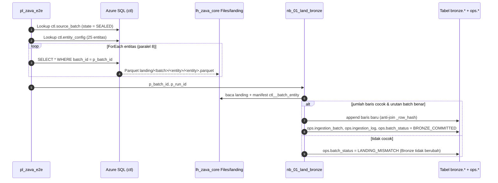

# Lab 04 - Ingestion dengan Copy activity ke Bronze

Bronze adalah salinan sumber yang **dapat diaudit**: setiap baris membawa hash, waktu ingest, run ID pipeline, dan path landing. Lab ini membangun bagian pertama pipeline `pl_zava_e2e`, yaitu ingestion berbasis metadata. Satu aktivitas Copy di dalam ForEach menyalin 25 entitas sesuai `ctl.entity_config`. Notebook kemudian merekonsiliasi jumlah baris sebelum commit ke Bronze.

Dalam lab ini Anda akan:

- [ ] Membuat Lakehouse `lh_zava_core` dengan schema dan mengimpor notebook workshop.
- [ ] Membuat koneksi Azure SQL dan pipeline Lookup → ForEach → Copy.
- [ ] Menjalankan `nb_01_land_bronze` untuk rekonsiliasi landing dan append idempoten ke Bronze.
- [ ] Membuktikan bahwa menjalankan ulang batch yang sama tidak menambah baris.

## Prasyarat

- [Lab 03](03-azure-sql-source.md) selesai: `B0` berstatus `SEALED`.
- Workspace `ws-zava-ppdm-demo` dengan peran Admin/Member.

## Alur ingestion



## 1. Buat Lakehouse inti

1. Di workspace `ws-zava-ppdm-demo`, pilih **+ New item** > **Lakehouse**.
2. Beri nama **`lh_zava_core`** dan centang **Lakehouse schemas**.
3. Pilih **Create**.

> [!NOTE]
> Schema (`bronze`, `silver`, `silver_ext`, `quarantine`, `ops`, `serve`, dan `stg_df`) dibuat otomatis oleh notebook. Anda hanya perlu membuat `stg_df` secara manual di Lab 05, sebelum Dataflow menulis ke schema tersebut.

## 2. Impor notebook

1. Di workspace, pilih **Import** > **Notebook** > **From this computer**.
2. Pilih file berikut dari `assets/fabric/notebooks/`: `nb_00_common.ipynb`, `nb_01_land_bronze.ipynb`, `nb_02_conform_master_ppdm.ipynb`, `nb_03_conform_production.ipynb`, `nb_04_conform_business.ipynb`, dan `nb_05_validate_and_serve.ipynb`.
3. Untuk **setiap** notebook `nb_01` sampai `nb_05`:
   1. Buka notebook.
   2. Di panel **Explorer**, pilih **Add data items** > **Existing data sources**, lalu pilih `lh_zava_core`.
   3. Pastikan `lh_zava_core` ditandai sebagai Lakehouse **default** (ikon pin).

> [!IMPORTANT]
> Notebook memuat helper dengan `%run nb_00_common`. Karena itu, `nb_00_common` harus berada di workspace yang sama dan **tidak** dijalankan sendiri. Sel pertama setiap notebook adalah **parameter cell**, sehingga pipeline dapat mengisi `p_batch_id` dan `p_run_id`.

## 3. Buat pipeline bagian ingestion

1. Pilih **+ New item** > **Data pipeline**, lalu beri nama **`pl_zava_e2e`**.
2. Di kanvas kosong, pilih tab **Parameters** dan tambahkan `p_batch_id` (String, default `B0`) dan `p_fail_after_bronze` (String, default `false`).
3. Tambahkan aktivitas **1–5** dari [lembar aktivitas pipeline](../assets/fabric/pipelines/pipeline-activity-sheet.md):

   | Aktivitas | Hal yang perlu diperhatikan |
   |---|---|
   | `lkp_sealed_batch` (Lookup) | Di **Connection**, pilih **More** > **Azure SQL database**. Buat koneksi `conn_sql_zava_source` ke server dan database Anda dengan **Organizational account**. Pilih **Query** dan tempel ekspresi E1. |
   | `if_batch_sealed` (If Condition) | Expression E2. Di cabang **False**, tambahkan aktivitas **Fail** dengan pesan E3. Biarkan cabang **True** kosong. |
   | `lkp_entities` (Lookup) | Query E4; hapus centang **First row only**. |
   | `fe_copy_entities` (ForEach) | Items E5; Batch count 8. Di dalam ForEach, tambahkan Copy `cp_entity_to_landing` dengan source query E6 dan destination Lakehouse `lh_zava_core` > **Files**, folder E7, file E8, format **Parquet**. |
   | `nb_01_land_bronze` (Notebook) | Pilih notebook, buka **Base parameters**, lalu isi `p_batch_id` = E9 dan `p_run_id` = E10. |

4. Hubungkan aktivitas dengan panah **On success** sesuai kolom *Bergantung pada*.
5. Pilih **Save**, lalu **Validate**.

> [!NOTE]
> **Opsi B (SQL privat):** pada aktivitas Lookup dan Copy, pilih koneksi `conn_sql_zava_source` yang dibuat pada VNet data gateway di Lab 03. Tidak ada perubahan lain pada pipeline.
>
> **Jalur cepat fasilitator:** setelah semua notebook dan Dataflow ada, `python -m workshop deploy-pipelines --config config/local.json --pipeline pl_zava_e2e` membuat pipeline lengkap dari [definisi yang sudah diuji](../assets/fabric/pipelines/definitions/pl_zava_e2e.json). Peserta tetap disarankan membangun aktivitas 1–5 secara manual agar memahami alurnya.

> [!TIP]
> Untuk mempercepat sesi notebook berikutnya, aktifkan **High concurrency mode for pipeline running multiple notebooks** di Workspace settings > Data Engineering/Science > Spark settings. Lalu isi **Session tag** yang sama, misalnya `zava`, pada setiap aktivitas Notebook.

## 4. Jalankan untuk B0

1. Pilih **Run**, lalu biarkan `p_batch_id = B0`.
2. Pantau tab **Output**. Copy menyalin 25 entitas, lalu `nb_01_land_bronze` berjalan.
3. Buka output aktivitas `nb_01_land_bronze`. *Exit value* berisi ringkasan seperti berikut:

   ```json
   {"batch_id": "B0", "status": "BRONZE_COMMITTED", "already_committed": false, "entities": 25, "new_bronze_rows": 134597}
   ```

## 5. Buktikan idempotensi

1. Jalankan pipeline **sekali lagi** dengan `p_batch_id = B0`.
2. Exit value sekarang menunjukkan `"already_committed": true` dan `"new_bronze_rows": 0`.

Pipeline aman di-*retry* karena baris Bronze diidentifikasi dengan `_row_hash` dan landing ditimpa per batch.

## Verifikasi

Buka `lh_zava_core` > **SQL analytics endpoint**, lalu jalankan query berikut:

```sql
SELECT BatchId, CommitOrder, PeriodStart, PeriodEnd FROM ops.ingestion_batch ORDER BY CommitOrder;
SELECT EntityName, ExpectedRows, LandedRows, NewBronzeRows FROM ops.ingestion_log WHERE BatchId = 'B0' ORDER BY EntityName;
SELECT COUNT(*) AS rows_my FROM bronze.src_my__production_report;
```

| Pemeriksaan | Hasil yang diharapkan |
|---|---|
| `ops.ingestion_batch` | Satu baris `B0`, `CommitOrder = 1` |
| `ops.ingestion_log` | 25 entitas dengan `ExpectedRows = LandedRows` |
| `bronze.src_my__production_report` | 43.800 baris (tidak berlipat setelah run kedua) |
| Files | `Files/landing/B0/` berisi 25 folder entitas |

## Pemecahan masalah

| Gejala | Penyebab | Solusi |
|---|---|---|
| Lookup gagal `Cannot open server` | Firewall Azure SQL | Pastikan `allowAzureServices=true` (Lab 03) atau gunakan VNet data gateway |
| `fail_batch_not_sealed` | Batch belum dimuat atau salah ketik | `python -m workshop status --config config/local.json` |
| `Landing does not match the source manifest` | Copy sebagian gagal atau path salah | Periksa ekspresi E7/E8; jalankan ulang pipeline (aman) |
| `Batch order violation` | Batch dijalankan tidak berurutan | Proses batch sesuai urutan `B0 → B1 → C1 → ...` |
| `%run nb_00_common` gagal | Notebook helper belum diimpor | Impor `nb_00_common.ipynb` ke workspace yang sama |

## Langkah berikutnya

**Lanjut ke:** [Lab 05 - ETL dengan Dataflow Gen2](05-dataflow-gen2-etl.md) →

## Referensi

- [Create a lakehouse with schemas](https://learn.microsoft.com/fabric/data-engineering/lakehouse-schemas)
- [Azure SQL Database connector overview](https://learn.microsoft.com/fabric/data-factory/connector-azure-sql-database-overview)
- [Lookup activity](https://learn.microsoft.com/fabric/data-factory/lookup-activity)
- [ForEach activity](https://learn.microsoft.com/fabric/data-factory/foreach-activity)
- [Copy activity](https://learn.microsoft.com/fabric/data-factory/copy-data-activity)
- [Notebook activity](https://learn.microsoft.com/fabric/data-factory/notebook-activity)
- [Expressions and functions in Data Factory](https://learn.microsoft.com/fabric/data-factory/expression-language)
- [How to use Microsoft Fabric notebooks](https://learn.microsoft.com/fabric/data-engineering/how-to-use-notebook)
