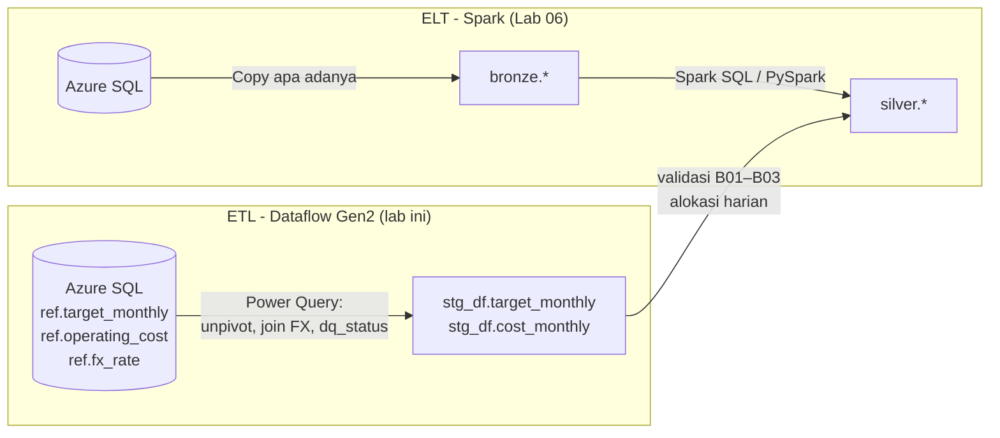

# Lab 05 - ETL dengan Dataflow Gen2

Tidak semua transformasi cocok dikerjakan dengan Spark. Target RKAP datang sebagai tabel *wide* (12 kolom bulan), dan biaya operasi perlu dikonversi ke USD. Tim bisnis atau analis biasanya mengerjakan transformasi seperti ini di Power Query. Lab ini memakai pola **ETL**: data ditransformasikan *sebelum* mendarat di Lakehouse, lalu ditulis ke schema staging `stg_df`. Notebook Spark di Lab 06 kemudian memeriksa dan memakai hasil tersebut.

Dalam lab ini Anda akan:

- [ ] Membuat dua Dataflow Gen2 dengan parameter publik `pBatchId`.
- [ ] Melakukan unpivot target bulanan dan konversi biaya ke USD dengan validasi `dq_status`.
- [ ] Menulis ke Lakehouse schema `stg_df` dengan metode **Replace**.

## Prasyarat

- [Lab 04](04-copy-ingestion-bronze.md) selesai.
- Koneksi Azure SQL dengan **Organizational account**. Dataflow Gen2 tidak mendukung service principal untuk konektor Azure SQL.

## ETL vs ELT dalam workshop ini



## 1. Siapkan schema staging

1. Buka `lh_zava_core`.
2. Di Explorer, pilih **...** di samping **Tables** > **New schema**.
3. Beri nama **`stg_df`**.

## 2. Buat `df_zava_target_etl`

1. Di workspace `ws-zava-ppdm-demo`, pilih **+ New item** > **Dataflow Gen2**. Beri nama `df_zava_target_etl` dan biarkan **Git integration, deployment pipelines and Public API scenarios** tetap aktif agar Dataflow mendukung CI/CD.
2. Pilih **Home** > **Manage parameters** > **New parameter**:

   | Properti | Nilai |
   |---|---|
   | Name | `pBatchId` |
   | Required | ❌ (biarkan tidak dicentang agar Dataflow tetap dapat dijalankan manual) |
   | Type | Text |
   | Current value | `B0` |

3. Pilih **Get data** > **Blank query**. Buka **Advanced editor**, lalu tempel isi [`df_zava_target_etl.pq`](../assets/fabric/dataflows/df_zava_target_etl.pq). Ganti `<SERVER>` dengan nama logical server Anda.
4. Saat diminta, pilih **Configure connection** dan gunakan koneksi Azure SQL dengan **Organizational account**. Pada opsi B (SQL privat), pilih koneksi `conn_sql_zava_source` pada VNet data gateway `vnetgw-zava-ssot`. Seluruh Dataflow, termasuk penulisan ke Lakehouse, akan berjalan melalui gateway tersebut.
5. Ganti nama query menjadi **`target_monthly`**.
6. Periksa langkah **Unpivoted** dan **WithStatus** di panel *Applied steps*. Setiap baris sumber berubah menjadi 12 baris bulanan dengan `month_start` dan `dq_status`.

### Atur data destination

1. Pilih **+** di kanan bawah query, atau **Home** > **Add data destination**, lalu pilih **Lakehouse**.
2. Pada koneksi Lakehouse, aktifkan **Navigate using full hierarchy**. Tanpa opsi ini, schema Lakehouse tidak ditampilkan.
3. Pilih `ws-zava-ppdm-demo` > `lh_zava_core` > **`stg_df`** > **New table** `target_monthly`.
4. Pilih **Update method = Replace** dan biarkan schema mapping mengikuti tipe kolom M.
5. Pilih **Save settings**.

### Aktifkan parameter publik

1. Pilih **Home** > **Options** > **Parameters**.
2. Centang **Enable parameters to be discovered and override for execution**, lalu pilih **OK**.
3. Pilih **Save**, lalu **Run**.

## 3. Buat `df_zava_cost_etl`

Ulangi langkah 2 dengan perbedaan berikut:

| Pengaturan | Nilai |
|---|---|
| Nama Dataflow | `df_zava_cost_etl` |
| Skrip M | [`df_zava_cost_etl.pq`](../assets/fabric/dataflows/df_zava_cost_etl.pq) |
| Nama query/tabel | `cost_monthly` |
| Destination | `lh_zava_core` > `stg_df` > `cost_monthly`, Replace |

Skrip ini melakukan *left join* biaya ke kurs bulanan. Baris tanpa kurs diberi status `MISSING_FX`, dan jumlah negatif diberi status `NEGATIVE_AMOUNT`. Kedua status tersebut menjadi blocker B03 di Lab 06.

## Verifikasi

Di SQL analytics endpoint `lh_zava_core`, jalankan:

```sql
SELECT batch_id, dq_status, COUNT(*) AS rows_count, SUM(target_value) AS total_value
FROM stg_df.target_monthly GROUP BY batch_id, dq_status;

SELECT batch_id, dq_status, COUNT(*) AS rows_count, SUM(amount_usd) AS total_usd
FROM stg_df.cost_monthly GROUP BY batch_id, dq_status;
```

| Tabel | Hasil yang diharapkan untuk `B0` |
|---|---|
| `stg_df.target_monthly` | 144 baris `VALID` (6 field × 2 komoditas × 12 bulan) |
| `stg_df.cost_monthly` | 288 baris `VALID`, `total_usd` ≈ 18.780.956 |

> [!NOTE]
> Kolom angka dari Dataflow bertipe `double` (`type number`). Notebook `nb_04` mengubahnya ke `decimal(19,6)` dan `decimal(19,4)` sebelum masuk Silver, sehingga total Gold tetap presisi.

## Pemecahan masalah

| Gejala | Solusi |
|---|---|
| Schema `stg_df` tidak terlihat di destination | Aktifkan **Navigate using full hierarchy** pada koneksi Lakehouse |
| `The parameter ... is required` saat pipeline berjalan | Pastikan `pBatchId` tidak bertanda Required, atau isi nilainya di aktivitas Dataflow |
| Kredensial Azure SQL ditolak | Gunakan Organizational account; service principal tidak didukung untuk Dataflow Gen2 + Azure SQL |
| Dataflow berhasil tetapi tabel kosong | Periksa `pBatchId` dan pastikan batch sudah dimuat ke Azure SQL |

## Langkah berikutnya

> [!div class="nextstepaction"]
> [Lab 06 - ELT Spark ke Silver PPDM-aligned](06-spark-elt-silver.md)

## Referensi

- [Create your first Dataflow Gen2](https://learn.microsoft.com/fabric/data-factory/create-first-dataflow-gen2)
- [Use public parameters in Dataflow Gen2](https://learn.microsoft.com/fabric/data-factory/dataflow-parameters)
- [Dataflow Gen2 data destinations and managed settings](https://learn.microsoft.com/fabric/data-factory/dataflow-gen2-data-destinations-and-managed-settings)
- [Azure SQL Database connector overview](https://learn.microsoft.com/fabric/data-factory/connector-azure-sql-database-overview)
- [Unpivot columns (Power Query)](https://learn.microsoft.com/power-query/unpivot-column)
