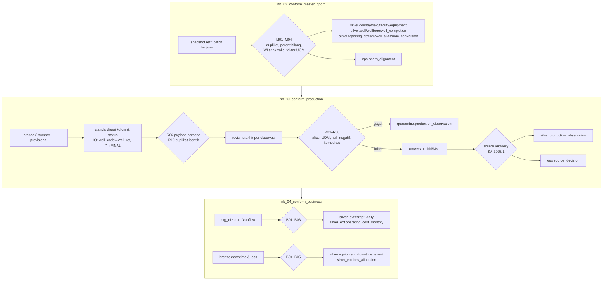

# Lab 06 - ELT Spark ke Silver PPDM-aligned

Silver adalah tempat makna data disepakati. Tiga sumber dengan satuan, nama kolom, dan ID berbeda diubah menjadi satu model kanonis yang *PPDM-aligned*. Satu angka berwenang dipilih untuk setiap reporting stream, tanggal, dan komoditas, dan setiap keputusan disimpan sebagai bukti. Lab ini memakai pola **ELT**: data mentah sudah ada di Bronze, lalu Spark mentransformasikannya di dalam Lakehouse.

Dalam lab ini Anda akan:

- [ ] Membangun golden master well, wellbore, dan completion dengan pemeriksaan integritas M01–M04.
- [ ] Menstandarkan tiga sumber produksi, mendeteksi duplikat/konflik, dan memilih revisi terakhir.
- [ ] Menerapkan source authority register dan menyimpan keputusan serta quarantine.
- [ ] Menggabungkan hasil ETL Dataflow dengan downtime dan loss allocation.

## Prasyarat

- [Lab 04](04-copy-ingestion-bronze.md) dan [Lab 05](05-dataflow-gen2-etl.md) selesai untuk `B0`.

## Alur notebook



## 1. Jalankan `nb_02_conform_master_ppdm`

1. Buka `nb_02_conform_master_ppdm`. Parameter cell sudah berisi `p_batch_id = "B0"`.
2. Pilih **Run all**.
3. Pelajari sel **Register alignment PPDM**. Daftar ini sama dengan [`ppdm_alignment_register.csv`](../assets/contracts/ppdm_alignment_register.csv) dan ditulis ke `ops.ppdm_alignment` bersama `MappingVersion = PPDM-ALIGN-1.0`.

Output akhir:

```json
{"batch_id": "B0", "stage": "SILVER_MASTER", "issues": {}, "wells": 120, "wellbores": 150, "completions": 180}
```

## 2. Jalankan `nb_03_conform_production`

1. Buka `nb_03_conform_production` dan pilih **Run all**.
2. Perhatikan sel standardisasi:
   - DZ melaporkan minyak dan air dalam `m3`. Faktor konversi ke bbl berasal dari `silver.uom_conversion`.
   - IQ memakai nama kolom lokal dan gas dalam `scf`. Kolom diganti namanya ke model kanonis, lalu gas dikonversi ke Mscf.
3. Perhatikan sel **Source authority**. Kandidat dipilih berdasarkan aturan di Lab 01. Keputusan hanya disimpan jika ada lebih dari satu kandidat atau statusnya bukan `SELECTED`.

Output akhir untuk `B0`:

```json
{"batch_id": "B0", "stage": "SILVER_PRODUCTION", "issues": {}, "observations": 131400, "decisions": 0}
```

> [!NOTE]
> `decisions = 0` adalah hasil yang benar untuk B0 karena setiap stream-day hanya memiliki satu kandidat final. Keputusan pertama muncul di batch `S1` (Lab 13), ketika laporan provisional bertabrakan dengan laporan final.

## 3. Jalankan `nb_04_conform_business`

1. Buka `nb_04_conform_business` dan pilih **Run all**.
2. Perhatikan alokasi target harian. Target bulanan dibagi rata per hari, lalu **sisa pembulatan diletakkan di hari terakhir**, sehingga jumlah harian selalu sama persis dengan target bulanan.
3. Perhatikan loss allocation. `well_ref` adalah golden `well_id` karena tim operasi mengalokasikan loss memakai registry SSOT. Nilai USD memakai harga indikatif harian.

Output akhir:

```json
{"batch_id": "B0", "stage": "SILVER_BUSINESS", "issues": {}, "target_days": 2190, "loss_rows": 40}
```

## 4. Telusuri hasil di SQL analytics endpoint

```sql
-- Golden master: alias sumber menunjuk ke satu well
SELECT w.well_id, w.well_name, a.source_system, a.source_well_id
FROM silver.well AS w JOIN silver.well_alias AS a ON a.well_id = w.well_id
WHERE w.well_id = 'MY_B_W001';

-- Well dengan dua wellbore (konsep PPDM: well ≠ wellbore)
SELECT TOP 5 well_id, COUNT(*) AS wellbores FROM silver.wellbore GROUP BY well_id HAVING COUNT(*) > 1;

-- Satu angka berwenang per stream x tanggal x komoditas
SELECT commodity, standard_uom, COUNT(*) AS rows_count, SUM(value_std) AS total
FROM silver.production_observation GROUP BY commodity, standard_uom;

-- Status setiap tahap batch
SELECT BatchId, Stage, Status, BlockerCount, WarningCount, InfoCount FROM ops.batch_status ORDER BY UpdatedAtUtc;
```

## Verifikasi

| Tabel | Hasil yang diharapkan untuk `B0` |
|---|---|
| `silver.well` / `silver.wellbore` / `silver.well_completion` | 120 / 150 / 180 |
| `silver.production_observation` | 131.400 baris; Oil 11.502.132,086117 bbl, Gas 74.030.662,241993 Mscf, Water 10.174.924,312177 bbl |
| `quarantine.production_observation` | 0 baris |
| `silver_ext.target_daily` | 2.190 baris (6 field × 365 hari) |
| `silver_ext.loss_allocation` | 40 baris, `lost_boe_gross` total 4.000 |
| `ops.batch_status` | `SILVER_MASTER_DONE`, `SILVER_PRODUCTION_DONE`, `SILVER_BUSINESS_DONE` |

## Pemecahan masalah

| Gejala | Penyebab | Solusi |
|---|---|---|
| `Batch B0 is not the latest committed batch` | Silver hanya dibangun untuk batch terbaru | Jalankan notebook dengan batch terakhir di `ops.ingestion_batch` |
| `B01` blocker | Dataflow belum dijalankan untuk batch ini | Jalankan kedua Dataflow dengan `pBatchId` yang sama, lalu ulangi `nb_04` |
| `F1 failure drill` error | `p_fail_after_bronze = "true"` | Ubah ke `"false"`; drill ini dipakai di Lab 08 |
| Total berbeda dari tabel di atas | Profil generator tidak standar | Pastikan Lab 02 memakai `--profile standard` |

## Langkah berikutnya

> [!div class="nextstepaction"]
> [Lab 07 - Gold Warehouse dan publikasi](07-gold-warehouse-publication.md)

## Referensi

- [Lakehouse and Delta Lake tables](https://learn.microsoft.com/fabric/data-engineering/lakehouse-and-delta-tables)
- [Develop, execute, and manage Microsoft Fabric notebooks](https://learn.microsoft.com/fabric/data-engineering/author-execute-notebook)
- [NotebookUtils for Fabric](https://learn.microsoft.com/fabric/data-engineering/notebook-utilities)
- [Implement medallion lakehouse architecture](https://learn.microsoft.com/fabric/onelake/onelake-medallion-lakehouse-architecture)
