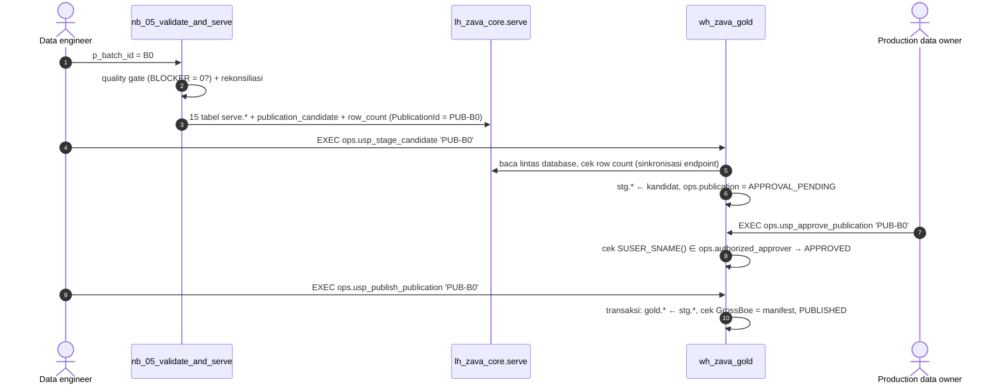

# Lab 07 - Gold Warehouse dan siklus publikasi SSOT

Gold adalah **satu-satunya** sumber angka yang boleh dikonsumsi pengguna bisnis. Di workshop ini, Gold berada di **Fabric Warehouse** `wh_zava_gold`. Kandidat dari Lakehouse terlebih dahulu masuk ke schema `stg`, lalu harus **disetujui pemilik data** sebelum dipindahkan ke `gold`, dalam satu transaksi beserta pemeriksaan total kontrol.

Dalam lab ini Anda akan:

- [ ] Menjalankan quality gate dan membuat kandidat publikasi `PUB-B0` dengan `nb_05_validate_and_serve`.
- [ ] Membuat Warehouse, objek Gold, dan prosedur siklus publikasi.
- [ ] Menjalankan alur stage → approve → publish secara manual dan memeriksa jejak auditnya.

## Prasyarat

- [Lab 06](06-spark-elt-silver.md) selesai untuk `B0`.

## Siklus publikasi



## 1. Buat kandidat publikasi

1. Buka `nb_05_validate_and_serve` dengan `p_batch_id = "B0"`, lalu pilih **Run all**.
2. Notebook melakukan langkah berikut:
   - memeriksa bahwa ketiga tahap Silver selesai;
   - **quality gate**: jika ada issue `BLOCKER`, status menjadi `QUALITY_FAILED` dan notebook berhenti dengan error;
   - membuat dimensi dengan *surrogate key* stabil (`xxhash64`) dan fakta harian dengan grid lengkap stream × hari;
   - **rekonsiliasi** jumlah baris, volume, loss, dan target terhadap Silver;
   - menulis tabel `serve.*` secara idempoten per `PublicationId`.
3. Output akhir memuat total kontrol:

   ```json
   {"batch_id": "B0", "publication_id": "PUB-B0", "status": "CANDIDATE_READY",
    "control_totals": {"GrossBoe": "23840575.796184", "NetWiBoe": "9429006.223961", ...}}
   ```

## 2. Buat Warehouse dan objek Gold

1. Di workspace `ws-zava-ppdm-demo`, pilih **+ New item** > **Warehouse** dan beri nama **`wh_zava_gold`**.
2. Pilih **New SQL query**. Tempel isi [`01_create_objects.sql`](../assets/sql/warehouse/01_create_objects.sql), lalu pilih **Run**. Setiap `GO` dijalankan sebagai batch terpisah.
3. Ulangi untuk [`02_procedures.sql`](../assets/sql/warehouse/02_procedures.sql).
4. Buka [`03_seed_contracts.sql`](../assets/sql/warehouse/03_seed_contracts.sql). Ganti **kedua** `<APPROVER_UPN>` dengan UPN Anda, lalu jalankan. Query terakhir harus menampilkan `CurrentUser` yang sama dengan `ApproverUpn`.

Objek yang dibuat:

| Schema | Isi |
|---|---|
| `stg` | 15 tabel kandidat, bisa berisi beberapa `PublicationId` |
| `gold` | 15 tabel yang sama, **hanya satu** publikasi yang disetujui; PK `NOT ENFORCED` pada dimensi |
| `ops` | `publication`, `publication_event`, `authorized_approver`, `kpi_contract`, `quality_evidence`, `dq_issue_summary`, `consumer_status`, dan view `vw_current_publication` / `vw_publication_history` |

> [!NOTE]
> Fabric Warehouse mendukung PRIMARY KEY, FOREIGN KEY, dan UNIQUE hanya dengan `NOT ENFORCED`. Constraint ini membantu optimizer dan semantic model, tetapi tidak mencegah duplikat. Karena itu, keunikan dijamin oleh rekonsiliasi di `nb_05`.

## 3. Stage kandidat

```sql
EXEC ops.usp_stage_candidate @PublicationId = 'PUB-B0', @RunId = 'manual-lab07';
```

Prosedur membaca `lh_zava_core.serve.*` dengan nama tiga bagian (*cross-database query*). Sebelum menyalin data, prosedur memastikan jumlah baris yang terlihat di SQL analytics endpoint sama dengan manifest `serve.publication_row_count`.

> [!TIP]
> Jika muncul error **50011**, metadata SQL analytics endpoint belum tersinkron dengan tabel Delta terbaru. Tunggu 1–2 menit lalu jalankan ulang. Di Lab 08, pipeline menangani kondisi ini dengan *retry*.

## 4. Setujui sebagai pemilik data

```sql
EXEC ops.usp_approve_publication @PublicationId = 'PUB-B0', @Decision = 'APPROVE',
     @Comment = 'Baseline 2025 reviewed against expected results';
```

Prosedur mencatat `SUSER_SNAME()` sebagai `DecidedBy`. Pengguna yang tidak terdaftar di `ops.authorized_approver` akan mendapat error **50021**.

> [!IMPORTANT]
> Dalam workshop, Anda berperan sebagai engineer **dan** pemilik data. Di produksi, approval harus dilakukan oleh orang lain dari peran bisnis, dengan izin Warehouse yang hanya memungkinkan `EXECUTE` pada prosedur approval.

## 5. Publikasikan ke Gold

```sql
EXEC ops.usp_publish_publication @PublicationId = 'PUB-B0', @RunId = 'manual-lab07';
```

Dalam satu transaksi, prosedur:

1. mengganti isi `gold.*` dengan `stg.*` untuk `PUB-B0`;
2. membandingkan `SUM(GrossBoe)` di Gold dengan `ControlTotalsJson` dan melakukan *rollback* bila berbeda;
3. menandai publikasi sebelumnya `SUPERSEDED` dan `PUB-B0` menjadi `PUBLISHED`.

## Verifikasi

Jalankan [`04_validate_gold.sql`](../assets/sql/warehouse/04_validate_gold.sql). Bandingkan dengan `publications.PUB-B0` di kunci jawaban.

| Query | Hasil yang diharapkan |
|---|---|
| 1. `vw_current_publication` | `PUB-B0`, `ApprovedBy` = UPN Anda |
| 3. Gold satu publikasi | `Publications = 1`; `fact_production_daily` 43.800 baris |
| 4. Kontrol total | `ManifestGrossBoe = GoldGrossBoe = 23840575.796184`; Net WI `9429006.223961` |
| 5. Per negara (gross) | Algeria 8.209.602,000694; Iraq 9.281.842,988721; Malaysia 6.349.130,806769 |
| 6. Fixture INC-MY-001 | 10 sumur; 4.000 BOE gross; 1.600 BOE net WI; USD 177.080 gross; 48 jam downtime |

## Pemecahan masalah

| Error | Arti | Solusi |
|---|---|---|
| 50010 | Kandidat tidak ditemukan | Jalankan `nb_05` atau tunggu sinkronisasi endpoint |
| 50011 | Row count endpoint belum cocok | Tunggu 1–2 menit, lalu ulangi |
| 50021 | Bukan approver | Periksa `SELECT SUSER_SNAME()` dan isi `ops.authorized_approver` |
| 50022 | Publikasi tidak menunggu approval | Lihat `ops.vw_publication_history`; mungkin sudah `SUPERSEDED` atau `APPROVED` |
| 50030 | Publish sebelum approve | Jalankan `usp_approve_publication` terlebih dahulu |
| 50031 | Total kontrol tidak cocok | Gold di-*rollback* otomatis; laporkan ke fasilitator |
| `Invalid object name 'lh_zava_core.serve...'` | Warehouse dan Lakehouse berada di workspace berbeda | Keduanya harus berada di `ws-zava-ppdm-demo` |

## Langkah berikutnya

**Lanjut ke:** [Lab 08 - Orkestrasi dan pemulihan](08-orchestration.md) →

## Referensi

- [Create a warehouse in Microsoft Fabric](https://learn.microsoft.com/fabric/data-warehouse/create-warehouse)
- [Write a cross-database query](https://learn.microsoft.com/fabric/data-warehouse/query-warehouse)
- [Transactions in Fabric Data Warehouse](https://learn.microsoft.com/fabric/data-warehouse/transactions)
- [Primary keys, foreign keys, and unique keys in Fabric Data Warehouse](https://learn.microsoft.com/fabric/data-warehouse/table-constraints)
- [Query using the SQL query editor](https://learn.microsoft.com/fabric/data-warehouse/sql-query-editor)
- [SQL analytics endpoint performance considerations](https://learn.microsoft.com/fabric/data-warehouse/sql-analytics-endpoint-performance)
- [SUSER_SNAME (Transact-SQL)](https://learn.microsoft.com/sql/t-sql/functions/suser-sname-transact-sql?view=fabric)
