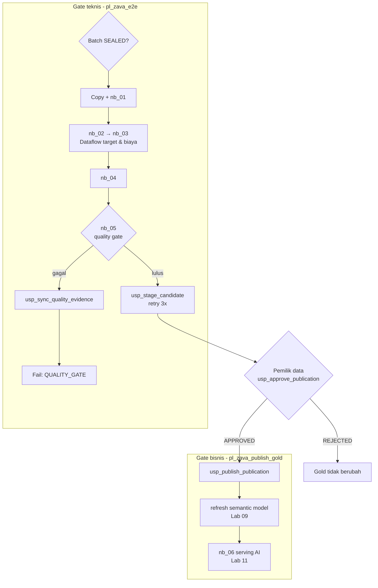
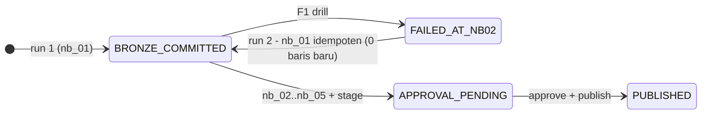

# Lab 08 - Orkestrasi, gate, dan pemulihan

Setelah setiap langkah terbukti benar secara manual, saatnya mengotomatiskannya. Pipeline harus melakukan lebih dari sekadar menjalankan langkah berurutan. Pipeline harus **berhenti di gate yang tepat**: batch belum tersegel, kualitas gagal, atau publikasi belum disetujui. Pipeline juga harus **aman dijalankan ulang** setelah gagal di tengah jalan.

Dalam lab ini Anda akan:

- [ ] Melengkapi `pl_zava_e2e` dengan transformasi, quality gate, staging, dan jalur kegagalan.
- [ ] Membuat `pl_zava_publish_gold` yang hanya berhasil untuk publikasi yang sudah disetujui.
- [ ] Menjalankan siklus penuh untuk `B1`, latihan kegagalan **F1** pada `C1`, dan batch duplikat `D1`.

## Prasyarat

- [Lab 07](07-gold-warehouse-publication.md) selesai: `PUB-B0` berstatus `PUBLISHED`.

## Gambaran orkestrasi



## 1. Lengkapi `pl_zava_e2e`

Buka `pl_zava_e2e`, lalu tambahkan aktivitas **6–15** dari [lembar aktivitas pipeline](../assets/fabric/pipelines/pipeline-activity-sheet.md).

1. **Notebook** `nb_02_conform_master_ppdm`, `nb_03_conform_production`, `nb_04_conform_business`, dan `nb_05_validate_and_serve`. Isi base parameter E9 dan E10; `nb_02` juga menerima `p_fail_after_bronze` = E11.
2. **Dataflow** `df_zava_target_etl` dan `df_zava_cost_etl`. Pada **Dataflow parameters**, pilih **Refresh**, lalu isi `pBatchId` = E9.
3. Hubungkan `nb_04` dengan **tiga** dependensi *On success*: `nb_03`, `df_zava_target_etl`, dan `df_zava_cost_etl`.
4. **Stored procedure** `sp_stage_candidate`. Di Settings, pilih Warehouse `wh_zava_gold` dan prosedur `ops.usp_stage_candidate`, lalu pilih **Import** parameter. Di tab **General**, isi **Retry** = 3 dan **Retry interval (sec)** = 120.
5. **Stored procedure** `sp_sync_quality_evidence_ok` setelah `sp_stage_candidate` (*On success*) dan `sp_sync_quality_evidence_fail` setelah `nb_05` (*On fail*).
6. **Fail** `fail_quality_gate` setelah `sp_sync_quality_evidence_fail` (*On completion*), dengan pesan E13.

> [!IMPORTANT]
> Aktivitas **Fail** wajib ada. Tanpa aktivitas ini, pipeline yang jalur kegagalannya sudah ditangani akan berstatus *Succeeded*, sehingga operator tidak melihat bahwa quality gate gagal.

## 2. Buat `pl_zava_publish_gold`

1. Buat pipeline baru **`pl_zava_publish_gold`** dengan parameter `p_publication_id` (String, default `PUB-B0`).
2. Tambahkan aktivitas **1** `sp_publish_publication` dari lembar aktivitas. Aktivitas 2–5 ditambahkan di Lab 09 dan Lab 11.

> [!TIP]
> Jika waktu kelas terbatas, fasilitator dapat membuat kedua pipeline dari [definisi JSON yang sudah diuji](../assets/fabric/pipelines/definitions/) dengan `python -m workshop deploy-pipelines --config config/local.json --pipeline pl_zava_e2e --pipeline pl_zava_publish_gold`. Perintah ini mencari ID workspace, Lakehouse, Warehouse, notebook, Dataflow, dan koneksi berdasarkan nama di `config/local.json`. Aktivitas semantic model dan serving AI hanya ditambahkan bila item tersebut sudah ada.

## 3. Siklus penuh untuk B1

1. Muat batch ke sumber:

   ```powershell
   python -m workshop load --config config/local.json --batch B1
   ```

2. Jalankan `pl_zava_e2e` dengan `p_batch_id = B1`. Semua aktivitas berstatus *Succeeded* dan `sp_stage_candidate` mengembalikan `APPROVAL_PENDING`.
3. Buka `wh_zava_gold`, lalu periksa kandidat sebelum menyetujuinya:

   ```sql
   SELECT PublicationId, Status, BlockerCount, WarningCount, InfoCount, ControlTotalsJson
   FROM ops.vw_publication_history ORDER BY StagedAtUtc DESC;

   EXEC ops.usp_approve_publication 'PUB-B1', 'APPROVE', 'One additional production day';
   ```

4. Jalankan `pl_zava_publish_gold` dengan `p_publication_id = PUB-B1`.
5. Verifikasi bahwa `SELECT * FROM ops.vw_current_publication;` menampilkan `PUB-B1`, dan `SUM(GrossBoe)` di `gold.fact_production_daily` bernilai **23.902.206,229593**.

## 4. Latihan kegagalan F1: gagal setelah Bronze, lalu pulihkan

Skenario ini menyimulasikan cluster Spark yang gagal setelah data mendarat di Bronze.

1. Muat `C1`: `python -m workshop load --config config/local.json --batch C1`.
2. Jalankan `pl_zava_e2e` dengan `p_batch_id = C1` dan **`p_fail_after_bronze = true`**.
3. Pipeline **gagal** di `nb_02_conform_master_ppdm` dengan pesan `F1 failure drill`.
4. Periksa status di SQL analytics endpoint `lh_zava_core`:

   ```sql
   SELECT BatchId, Stage, Status FROM ops.batch_status WHERE BatchId = 'C1';
   ```

   Tahap `BRONZE` berstatus `BRONZE_COMMITTED` dan tahap `SILVER_MASTER` berstatus `FAILED_DRILL`. Gold tetap `PUB-B1`.
5. Jalankan ulang pipeline dengan `p_batch_id = C1` dan `p_fail_after_bronze = false`.
6. Pada output `nb_01_land_bronze`, verifikasi `"already_committed": true` dan `"new_bronze_rows": 0`. Bronze tidak terduplikasi.
7. Setujui dan publikasikan `PUB-C1`. Gross BOE menjadi **23.902.231,190928** karena 24 revisi berwenang dari `SRC_DZ_PROD`.



## 5. Batch duplikat D1

1. Muat dan jalankan `D1` (`p_fail_after_bronze = false`).
2. Di `wh_zava_gold`, jalankan:

   ```sql
   SELECT BatchId, RuleId, Severity, SUM(IssueCount) AS Issues
   FROM ops.dq_issue_summary WHERE BatchId = 'D1' GROUP BY BatchId, RuleId, Severity;
   ```

   Hasilnya: `R10 INFO 100`. Duplikat identik dicatat, tetapi **tidak** dihitung dua kali dan tidak memblokir publikasi.
3. Setujui dan publikasikan `PUB-D1`. Total Gross BOE **sama** dengan `PUB-C1`.

## Verifikasi

| Publikasi | Status | Gross BOE | Catatan |
|---|---|---:|---|
| `PUB-B0` | `SUPERSEDED` | 23.840.575,796184 | Baseline |
| `PUB-B1` | `SUPERSEDED` | 23.902.206,229593 | +1 hari |
| `PUB-C1` | `SUPERSEDED` | 23.902.231,190928 | 24 revisi DZ; F1 dipulihkan |
| `PUB-D1` | `PUBLISHED` | 23.902.231,190928 | R10 = 100 (INFO) |

Buka **Monitor** (Monitoring hub) dan perhatikan riwayat run serta durasi setiap aktivitas.

## Pemecahan masalah

| Gejala | Solusi |
|---|---|
| `sp_stage_candidate` gagal 3 kali dengan 50011 | Endpoint belum sinkron. Jalankan ulang pipeline; semua langkah sebelumnya idempoten. |
| Pipeline *Succeeded* padahal quality gagal | Aktivitas `fail_quality_gate` belum dihubungkan *On completion* |
| Dataflow activity tidak menampilkan parameter | Aktifkan public parameter mode (Lab 05) lalu pilih **Refresh** |
| `pl_zava_publish_gold` gagal 50030 | Publikasi belum disetujui |
| Notebook lambat memulai sesi | Aktifkan high concurrency mode dan isi session tag yang sama |

## Langkah berikutnya

**Lanjut ke:** [Lab 09 - Semantic model Direct Lake](09-semantic-model.md) →

## Referensi

- [Dataflow activity](https://learn.microsoft.com/fabric/data-factory/dataflow-activity)
- [Stored procedure activity](https://learn.microsoft.com/fabric/data-factory/stored-procedure-activity)
- [If Condition activity](https://learn.microsoft.com/fabric/data-factory/if-condition-activity)
- [Fail activity](https://learn.microsoft.com/fabric/data-factory/fail-activity)
- [Activity overview: general settings, retry, and timeout](https://learn.microsoft.com/fabric/data-factory/activity-overview)
- [Run, schedule, or use events to trigger a pipeline](https://learn.microsoft.com/fabric/data-factory/pipeline-runs)
- [Monitor pipeline runs](https://learn.microsoft.com/fabric/data-factory/monitor-pipeline-runs)
