# Lab 09 - Semantic model Direct Lake yang berwenang

Semantic model menerapkan **kontrak KPI** di atas Gold. Setiap report dan data agent KPI memakai measure yang sama, sehingga tidak ada definisi "produksi" lain di file Excel atau visual tertentu. Model memakai **Direct Lake**: data dibaca langsung dari tabel Delta Warehouse tanpa salinan import, dan refresh hanya melakukan *reframing* ke versi tabel terbaru.

Dalam lab ini Anda akan:

- [ ] Membuat semantic model `sm_zava_performance` dari tabel `gold` dan `ops.publication`.
- [ ] Membuat relasi star schema, menandai tabel tanggal, dan menyembunyikan kolom teknis.
- [ ] Menambahkan semua measure sekaligus melalui DAX query view.
- [ ] Membuat role RLS per negara dan memvalidasi DAX terhadap SQL.
- [ ] Menambahkan refresh semantic model ke `pl_zava_publish_gold`.

## Prasyarat

- [Lab 08](08-orchestration.md) selesai. Publikasi aktif: `PUB-D1`.

## Model target

```mermaid
erDiagram
    dim_date ||--o{ fact_production_daily : DateKey
    dim_well ||--o{ fact_production_daily : WellKey
    dim_asset ||--o{ fact_production_daily : AssetKey
    dim_date ||--o{ fact_target_daily : DateKey
    dim_asset ||--o{ fact_target_daily : AssetKey
    dim_scenario ||--o{ fact_target_daily : ScenarioKey
    dim_date ||--o{ fact_operating_cost_monthly : MonthDateKey
    dim_asset ||--o{ fact_operating_cost_monthly : AssetKey
    dim_cost_category ||--o{ fact_operating_cost_monthly : CostCategoryKey
    dim_date ||--o{ fact_downtime_event : StartDateKey
    dim_incident ||--o{ fact_downtime_event : IncidentKey
    dim_equipment ||--o{ fact_downtime_event : EquipmentKey
    dim_asset ||--o{ fact_downtime_event : AssetKey
    dim_date ||--o{ fact_loss_allocation : DateKey
    dim_well ||--o{ fact_loss_allocation : WellKey
    dim_asset ||--o{ fact_loss_allocation : AssetKey
    dim_incident ||--o{ fact_loss_allocation : IncidentKey
    dim_equipment ||--o{ fact_loss_allocation : EquipmentKey
    dim_well ||--o{ source_decision : WellId
    dim_date ||--o{ source_decision : "Date = BusinessDate"
```

Tabel `publication` berdiri sendiri, tanpa relasi, dan dipakai oleh measure bukti SSOT.

## 1. Buat semantic model

1. Buka `wh_zava_gold`, lalu pilih **Reporting** > **New semantic model**.
2. Beri nama **`sm_zava_performance`**.
3. Pilih **13 tabel** dari schema `gold`: `dim_date`, `dim_asset`, `dim_well`, `dim_equipment`, `dim_incident`, `dim_scenario`, `dim_cost_category`, `fact_production_daily`, `fact_target_daily`, `fact_operating_cost_monthly`, `fact_downtime_event`, `fact_loss_allocation`, dan `source_decision`.
4. Tambahkan juga tabel **`ops.publication`**. Jangan memilih view; view membuat Direct Lake fallback ke DirectQuery.
5. Pilih **Confirm**.

> [!WARNING]
> Jangan pilih tabel dari schema `stg`. Tabel tersebut berisi kandidat yang belum disetujui. Jika nama tabel di model mendapat akhiran karena konflik nama, ganti namanya agar sama dengan [spesifikasi](../assets/powerbi/semantic-model-and-report-spec.md).

## 2. Relasi dan pengaturan model

1. Buka model dengan **Open data model** di mode **Editing**.
2. Buat 20 relasi sesuai tabel di [`semantic-model-and-report-spec.md`](../assets/powerbi/semantic-model-and-report-spec.md#relasi). Untuk setiap relasi, gunakan **Many to one**, **Single** cross-filter, dan centang **Make this relationship active**.
3. Pilih `dim_date` > **Mark as date table**, lalu pilih kolom `Date`.
4. Sembunyikan semua kolom `*Key` dan kolom `PublicationId` di semua tabel `gold` (dimensi dan fakta). Klik kanan kolom > **Hide in report view**. Kolom `PublicationId` tetap terlihat hanya di tabel `publication`.
5. Urutkan `dim_date[MonthName]` berdasarkan `MonthNumber`.

## 3. Tambahkan measure dengan DAX query view

1. Pilih **DAX query view** di sisi kiri.
2. Tempel seluruh isi [`measures.dax`](../assets/powerbi/measures.dax).
3. Pilih **Run** untuk menguji. Hasilnya berupa empat baris per negara.
4. Pilih **Update model with changes** pada CodeLens di atas `DEFINE`. Semua measure akan ditambahkan ke tabel masing-masing.
5. Atur format sesuai spesifikasi. BOE memakai `#,0`, persentase memakai satu desimal, dan USD memakai `$#,0`.

## 4. Buat role RLS

1. Pilih **Manage roles** > **New**.
2. Buat role `Country DZ`, `Country MY`, dan `Country IQ`. Setiap role memakai filter DAX pada `dim_asset` **dan** `dim_well`, misalnya `[CountryCode] = "MY"`.
3. Pilih **Save**.
4. Uji dengan **View as** > `Country MY`. Measure `[Gross BOE]` harus bernilai 6.365.583 (`PUB-D1`).

## 5. Validasi DAX terhadap SQL

1. Di DAX query view, jalankan setiap query dalam [`validation_queries.dax`](../assets/powerbi/validation_queries.dax).
2. Di `wh_zava_gold`, jalankan [`04_validate_gold.sql`](../assets/sql/warehouse/04_validate_gold.sql).
3. Isi tabel berikut. Angka DAX dan SQL **harus identik**.

| Ukuran (`PUB-D1`) | SQL | DAX | Kunci jawaban |
|---|---|---|---:|
| Gross BOE | | | 23.902.231,190928 |
| Net WI BOE | | | 9.453.387,100611 |
| Gross BOE Malaysia | | | 6.365.583,444751 |
| Lost BOE gross INC-MY-001 | | | 4.000 |
| Data completeness % | | | 100,0% |
| Current Publication | | | `PUB-D1` |

## 6. Tambahkan refresh ke pipeline publikasi

1. Buka `pl_zava_publish_gold`.
2. Tambahkan aktivitas **2** `sm_refresh_zava_performance` (**Semantic model refresh**) dan aktivitas **3** `sp_consumer_semantic_model` dari [lembar aktivitas](../assets/fabric/pipelines/pipeline-activity-sheet.md#pl_zava_publish_gold---publikasi-setelah-approval-bisnis).
3. Jalankan pipeline dengan `p_publication_id = PUB-D1`. Prosedur publish mengenali bahwa publikasi sudah `PUBLISHED`, sehingga hanya langkah refresh yang benar-benar bekerja.
4. Periksa `SELECT * FROM ops.consumer_status;`. Hasilnya harus menampilkan `SEMANTIC_MODEL` dan `REFRESHED` untuk `PUB-D1`.

## Verifikasi

- Measure `[Gold Matches Publication]` menampilkan `Consistent`.
- Tabel validasi di langkah 5 tidak memiliki selisih.
- `View as` role negara hanya menampilkan data negara tersebut.

## Pemecahan masalah

| Gejala | Solusi |
|---|---|
| **Update model with changes** tidak muncul | Pastikan model dalam mode *Editing* dan query diawali `DEFINE`. Atau tambahkan measure satu per satu. |
| Relasi ambigu atau tidak aktif | Jangan buat relasi `dim_well → dim_asset`; ikuti tabel relasi spesifikasi |
| Angka DAX berbeda dari SQL | Semantic model belum di-refresh setelah publikasi baru. Jalankan refresh atau pipeline publikasi. |
| Visual lambat/DirectQuery | Pastikan tidak ada view atau tabel `stg` di model; periksa *Direct Lake behavior* di pengaturan model |

## Langkah berikutnya

**Lanjut ke:** [Lab 10 - Report Power BI](10-power-bi-report.md) →

## Referensi

- [Direct Lake overview](https://learn.microsoft.com/fabric/fundamentals/direct-lake-overview)
- [Edit data models in the Power BI service](https://learn.microsoft.com/power-bi/transform-model/service-edit-data-models)
- [Work with DAX query view](https://learn.microsoft.com/power-bi/transform-model/dax-query-view)
- [Row-level security with Power BI](https://learn.microsoft.com/fabric/security/service-admin-row-level-security)
- [Semantic model refresh activity](https://learn.microsoft.com/fabric/data-factory/semantic-model-refresh-activity)
- [Model relationships in Power BI Desktop](https://learn.microsoft.com/power-bi/transform-model/desktop-relationships-understand)
