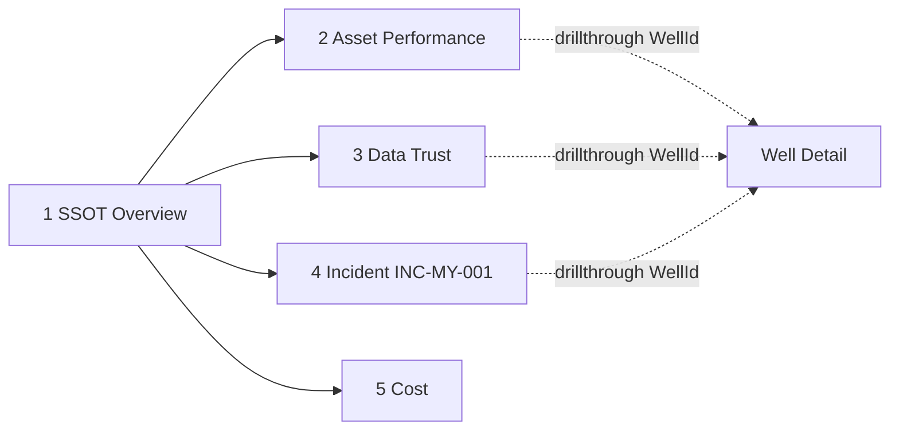

# Lab 10 - Report Power BI "Zava Energy SSOT - Performance & Data Trust"

Report yang baik menjawab pertanyaan bisnis dan sekaligus **menunjukkan mengapa angkanya bisa dipercaya**. Setiap halaman di report ini menampilkan *trust banner* berisi ID publikasi, approver, dan waktu publikasi. Satu halaman khusus membuka bukti SSOT: kelengkapan data, keputusan sumber, dan riwayat publikasi.

Dalam lab ini Anda akan:

- [ ] Membuat report dari `sm_zava_performance` dan menerapkan tema workshop.
- [ ] Membangun lima halaman dan satu halaman drillthrough sesuai spesifikasi.
- [ ] Memeriksa aksesibilitas dan konsistensi angka dengan Gold.

## Prasyarat

- [Lab 09](09-semantic-model.md) selesai.

> [!TIP]
> **Jalankan batch express sambil membangun report.** Muat `H1` (`python -m workshop load --config config/local.json --batch H1`), jalankan `pl_zava_e2e` dengan `p_batch_id = H1`, lalu setujui dan jalankan `pl_zava_publish_gold`. Ulangi untuk `X1`. Kedua batch ini harus selesai sebelum drill di Lab 13. Setelah setiap publikasi, report otomatis menampilkan angka terbaru karena pipeline publikasi me-refresh semantic model. Perhatikan bahwa Net WI DZ turun setelah `H1`, tetapi gross tidak berubah.

## Struktur report

## 1. Buat report dan terapkan tema

1. Buka `sm_zava_performance`, lalu pilih **Explore this data** > **Create a blank report**, atau **+ New report** dari halaman model.
2. Pilih **View** > **Themes** > **Browse for themes**, lalu pilih [`assets/powerbi/zava-ssot-theme.json`](../assets/powerbi/zava-ssot-theme.json).
3. Pilih **File** > **Save** dan beri nama **`Zava Energy SSOT - Performance & Data Trust`**.

> [!NOTE]
> Tema ini adalah palet workshop, **bukan** brand resmi perusahaan mana pun. Jika opsi impor tema tidak tersedia di service, buka report di Power BI Desktop dengan koneksi live ke semantic model dan terapkan tema di sana.

## 2. Header dengan trust banner

Untuk halaman pertama:

1. Tambahkan **Card**, isi dengan measure `publication[Trust Banner]`, lalu letakkan di bagian atas dengan lebar penuh.
2. Matikan label kategori. Atur font 12 pt dan warna latar `#F3F6FA`.
3. Salin card ini ke setiap halaman.

## 3. Bangun halaman

Ikuti [spesifikasi report](../assets/powerbi/semantic-model-and-report-spec.md#laporan-zava-energy-ssot---performance--data-trust) untuk setiap halaman. Ringkasan visual utama:

| Halaman | Visual | Field |
|---|---|---|
| **SSOT Overview** | 4 card | `Gross BOE`, `Net WI BOE`, `Target Achievement %`, `Data Completeness %` |
| | Line chart | X: `dim_date[Date]`; Y: `Gross BOE`, `Target BOE` |
| | Clustered bar | Y: `dim_asset[CountryName]`; X: `Gross BOE`, `Net WI BOE` |
| **Asset Performance** | Matrix | Rows: `CountryName` > `AssetName`; Values: `Gross BOE`, `Target BOE`, `Variance to Target BOE`, `Target Achievement %` |
| | Bar (Top N 10) | `dim_well[WellName]` berdasarkan `Gross BOE` |
| | Slicer | `dim_date[YearMonth]` |
| **Data Trust** | Card | `Current Publication`, `Approved By`, `Published At UTC`, `Gold Matches Publication` |
| | Bar | `CountryName` × `Data Completeness %` |
| | Table | `source_decision`: `WellId`, `BusinessDate`, `Commodity`, `DecisionStatus`, `SelectedSourceSystem`, `Reason` |
| | Table | `publication`: `PublicationId`, `Status`, `DecidedBy`, `PublishedAtUtc` |
| **Incident INC-MY-001** | Slicer | `dim_incident[IncidentId]` dengan nilai `INC-MY-001` |
| | Card | `Affected Wells`, `Lost BOE Gross`, `Lost BOE Net WI`, `Loss Value USD Gross`, `Downtime Hours` |
| | Column chart | X: `dim_well[WellName]`; Y: `Lost BOE Gross` |
| **Cost** | Stacked column | X: `dim_date[YearMonth]`; Y: `Opex USD`; Legend: `dim_cost_category[CostCategory]` |
| | Card | `Opex per BOE USD` |

> [!TIP]
> Pada halaman **Incident**, pilih `INC-MY-001` di slicer, lalu simpan. Pilihan slicer tersimpan sebagai *default* ketika pengguna membuka halaman.

## 4. Halaman drillthrough Well Detail

1. Tambahkan halaman **Well Detail**.
2. Di panel **Visualizations** > **Drill through**, seret `dim_well[WellId]` ke **Add drill-through fields here**.
3. Tambahkan card `WellName`, `AliasList`, `WellboreCount`, dan `CompletionCount`; line chart `Oil bbl`, `Gas Mscf`, dan `Water bbl` per `dim_date[Date]`; serta tabel `source_decision`.
4. Uji fitur ini: di halaman **Asset Performance**, klik kanan sumur `MY_B_W001` > **Drill through** > **Well Detail**.

## 5. Aksesibilitas dan kualitas

- Isi **Alt text** untuk setiap chart dengan pertanyaan yang dijawab visual tersebut.
- Atur urutan tab di **View** > **Selection** > **Tab order**.
- Gunakan judul yang menyebutkan satuan, misalnya “Gross production (BOE)”.
- Pastikan warna merah (`bad`) hanya dipakai untuk di bawah target atau isu kualitas.

## Verifikasi

| Pemeriksaan | Hasil yang diharapkan |
|---|---|
| Trust banner | `SSOT PUB-<aktif> | approved by <UPN> | published ... UTC` |
| Incident: Lost BOE Gross / Net WI | 4.000 / 1.600 |
| Incident: Loss Value USD Gross | 177.080 |
| Incident: Downtime Hours | 48 |
| Overview Gross BOE | Sama dengan `SUM(GrossBoe)` di `gold.fact_production_daily` untuk publikasi aktif |
| Drillthrough `MY_B_W001` | `AliasList` memuat `SRC_MY_OPS:MYB001` |

## Pemecahan masalah

| Gejala | Solusi |
|---|---|
| Visual kosong setelah publikasi baru | Pastikan pipeline publikasi menjalankan refresh semantic model, lalu refresh browser |
| Drillthrough tidak muncul | Visual sumber harus memakai field yang berasal dari `dim_well` |
| Tema tidak berubah | Muat ulang report; jika tema di-cache, ganti nama file tema lalu impor ulang |

## Langkah berikutnya

> [!div class="nextstepaction"]
> [Lab 11 - Fabric IQ ontology](11-ontology.md)

## Referensi

- [Create reports in the Power BI service](https://learn.microsoft.com/power-bi/create-reports/service-report-create-new)
- [Use report themes](https://learn.microsoft.com/power-bi/create-reports/desktop-report-themes)
- [Set up drillthrough](https://learn.microsoft.com/power-bi/create-reports/desktop-drillthrough)
- [Design accessible reports](https://learn.microsoft.com/power-bi/create-reports/desktop-accessibility-creating-reports)
- [Visualization best practices (card visual)](https://learn.microsoft.com/power-bi/visuals/power-bi-visualization-card)
