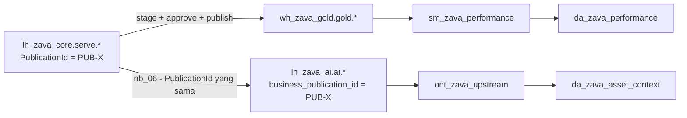
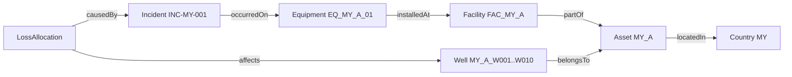

# Lab 11 - Fabric IQ ontology di atas publikasi SSOT

Semantic model menjawab pertanyaan **berapa**. Ontology menjawab pertanyaan **apa terhubung dengan apa**, misalnya sumur mana yang terdampak insiden, equipment apa yang menyebabkannya, dan laporan mana yang dipilih untuk sebuah stream. Ontology di workshop ini dibangun di atas **proyeksi AI** dari publikasi yang sama dengan Gold, bukan dari Silver terbaru yang mungkin belum disetujui.

Dalam lab ini Anda akan:

- [ ] Menyiapkan Lakehouse AI dan menjalankan `nb_06_prepare_ai_serving` untuk publikasi aktif.
- [ ] Membuat ontology `ont_zava_upstream` dengan 13 entity type dan data binding.
- [ ] Membuat 12 relationship type dan menjelajahi graf instance.
- [ ] Menambahkan serving AI ke pipeline publikasi.

## Prasyarat

- [Lab 09](09-semantic-model.md) selesai. Lab 10 boleh berjalan paralel.
- Gate **G4**: tenant setting **Users can create ontology (preview) items** aktif.
- Akses minimal **Viewer** di `ws-zava-ppdm-demo`, karena notebook AI membaca tabel lintas workspace.

> [!IMPORTANT]
> Ontology adalah fitur **preview**. Nama menu dapat berubah. Ikuti langkah konsep di bawah dan sesuaikan dengan UI terbaru di [tutorial ontology Microsoft Learn](https://learn.microsoft.com/fabric/iq/ontology/tutorial-1-create-ontology).

## Mengapa proyeksi AI terpisah



- Binding ontology membutuhkan **managed Lakehouse table** dengan key bertipe string atau integer, tanpa shortcut dan tanpa column mapping.
- Tabel `ai.*` memakai nama kolom `snake_case` yang mudah dipahami agent.
- Setiap baris membawa `business_publication_id`, sehingga jawaban agent dapat ditelusuri ke publikasi Gold yang sama.

## 1. Siapkan Lakehouse AI dan proyeksi

1. Di workspace **`ws-zava-ppdm-ai-demo`**, buat Lakehouse **`lh_zava_ai`** dengan **Lakehouse schemas** dicentang.
2. Impor `nb_00_common.ipynb` dan `nb_06_prepare_ai_serving.ipynb` dari `assets/fabric/notebooks/` ke workspace ini.
3. Buka `nb_06_prepare_ai_serving`, lalu jadikan `lh_zava_ai` Lakehouse default.
4. Di parameter cell, isi `p_publication_id` dengan publikasi aktif. Lihat `SELECT PublicationId FROM ops.vw_current_publication` di `wh_zava_gold`, misalnya `PUB-X1`.
5. Pilih **Run all**. Notebook membaca `` `ws-zava-ppdm-demo`.`lh_zava_core`.`serve`.<tabel> `` dengan nama empat bagian lintas workspace.

Output akhir:

```json
{"publication_id": "PUB-X1", "status": "AI_SERVING_READY", "tables": {"ai.country": 3, "ai.asset": 6, "ai.well": 120, "ai.wellbore": 150, ...}}
```

## 2. Buat ontology dan entity type

1. Di `ws-zava-ppdm-ai-demo`, pilih **+ New item** > **Ontology (preview)**. Beri nama **`ont_zava_upstream`**.
2. Untuk setiap baris di [`entity_types.csv`](../assets/ontology/entity_types.csv):
   1. Pilih **+ Add entity type** dan isi nama dari kolom `entity_type`, misalnya `Well`.
   2. Pilih **...** > **Bind data** > **Add**. Pilih `lh_zava_ai` > `ai` > tabel sesuai kolom `source_table`, misalnya `well`.
   3. Pilih **Entity type properties**, terima properti yang diusulkan, lalu pilih **Create**.
   4. Pada halaman **Configure**, atur **entity type key** ke kolom `key_property`, misalnya `well_id`. Atur nama tampilan ke `display_name_property`.
3. Ulangi untuk ke-13 entity type: `Country`, `Asset`, `Facility`, `Equipment`, `Well`, `Wellbore`, `Completion`, `ReportingStream`, `ProductionDay`, `Incident`, `LossAllocation`, `SourceDecision`, dan `Publication`.

> [!NOTE]
> Nama properti yang sama di beberapa entity type, misalnya `well_id` atau `business_publication_id`, harus memiliki tipe yang sama. Proyeksi `nb_06` sudah menjaga konsistensi ini.

## 3. Buat relationship type

Untuk setiap baris di [`relationship_types.csv`](../assets/ontology/relationship_types.csv):

1. Pilih entity asal (*origin*) di **Explorer** > **Add relationship**.
2. Isi **Relationship type name**, **Origin entity type**, dan **Target entity type**, lalu pilih **Create**.
3. Pada konfigurasi relasi, pilih properti asal (`origin_property`) dan properti target (`target_property`), lalu pilih **Save**.

> [!NOTE]
> Relasi di ontology di-*binding* ke tabel penghubung yang memuat **kedua** key. Tabel `ai.*` sudah dirancang demikian. Misalnya `ai.loss_allocation` memuat `loss_id`, `incident_id`, dan `well_id`, sehingga tabel entitas asal sekaligus menjadi tabel relasi.

Contoh hubungan untuk pertanyaan insiden:



## 4. Refresh dan jelajahi

1. Simpan ontology, lalu jalankan **refresh** item ontology. Refresh ini manual dan diperlukan setiap kali data sumber berubah. Fabric otomatis membuat item **GraphModel** `ont_zava_upstream_graph_<id>`. Untuk otomatisasi, jalankan job `RefreshGraph` pada item tersebut melalui [Job Scheduler REST API](https://learn.microsoft.com/rest/api/fabric/core/job-scheduler/run-on-demand-item-job).

> [!TIP]
> Jika tabel `ai.*` tidak terlihat saat binding atau saat data agent menjalankan SQL, sinkronkan metadata SQL analytics endpoint `lh_zava_ai`: buka endpoint tersebut lalu pilih **Refresh**. Endpoint dapat tertinggal beberapa menit setelah notebook menulis tabel baru.
2. Buka pratinjau graf atau *entity instances*, lalu cari instance `INC-MY-001`.
3. Telusuri `causedBy` → `LossAllocation` → `affects` → `Well`. Anda akan menemukan 10 sumur `MY_A_W001` sampai `MY_A_W010`.

## 5. Tambahkan serving AI ke pipeline publikasi

1. Buka `pl_zava_publish_gold` di `ws-zava-ppdm-demo`.
2. Tambahkan aktivitas **4** `nb_06_prepare_ai_serving` dan aktivitas **5** `sp_consumer_ai_serving` dari [lembar aktivitas](../assets/fabric/pipelines/pipeline-activity-sheet.md). Di Notebook activity, pilih **Workspace** `ws-zava-ppdm-ai-demo`.
3. Jalankan pipeline dengan publikasi aktif. `ops.consumer_status` sekarang menampilkan `SEMANTIC_MODEL` dan `AI_SERVING` untuk ID yang sama.

> [!IMPORTANT]
> Setelah setiap publikasi baru, refresh ontology secara manual. Jika lupa, ontology dan data agent konteks aset akan menjawab dengan publikasi lama. Hal ini terlihat dari `business_publication_id`.

## Verifikasi

| Pemeriksaan | Hasil yang diharapkan |
|---|---|
| `SELECT DISTINCT business_publication_id FROM ai.well` | Satu nilai = publikasi aktif Gold |
| `SELECT COUNT(*) FROM ai.loss_allocation` | 40 |
| Entity types / relationship types | 13 / 12 |
| Graf `INC-MY-001` | 1 equipment, 40 loss allocation, 10 well |

## Pemecahan masalah

| Gejala | Solusi |
|---|---|
| `nb_06`: `Publication ... has no serving candidate` | ID salah, atau `nb_05` belum dijalankan untuk batch tersebut |
| `nb_06`: tabel lintas workspace tidak ditemukan | Pastikan Anda punya akses ke `ws-zava-ppdm-demo` dan nama workspace memakai backtick |
| Item Ontology tidak bisa dibuat | Tenant setting G4 belum aktif |
| Tabel `ai.*` tidak muncul saat binding | Gunakan Lakehouse dengan schema, lalu refresh OneLake catalog |
| Key tidak dapat dipilih | Key harus string atau integer; gunakan kolom `*_id` |

## Langkah berikutnya

> [!div class="nextstepaction"]
> [Lab 12 - Fabric data agents](12-data-agents.md)

## Referensi

- [Ontology (preview) tutorial: create an ontology](https://learn.microsoft.com/fabric/iq/ontology/tutorial-1-create-ontology)
- [Create entity types in ontology (preview)](https://learn.microsoft.com/fabric/iq/ontology/how-to-create-entity-types)
- [Get started with Fabric IQ](https://learn.microsoft.com/fabric/iq/get-started-with-fabric-iq)
- [What are lakehouse schemas? (cross-workspace Spark SQL)](https://learn.microsoft.com/fabric/data-engineering/lakehouse-schemas)
