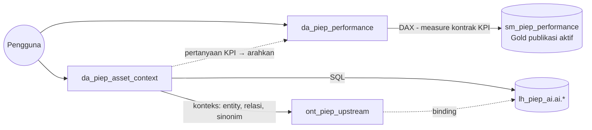

# Lab 12 - Fabric data agents: KPI dan konteks aset

Data agent memungkinkan pengguna bertanya dalam bahasa alami. Dalam konteks SSOT, agent **tidak boleh menjadi sumber kebenaran baru**: agent harus memakai measure dan publikasi yang sama dengan report, menyebutkan ID publikasi, dan menolak pertanyaan di luar data. Lab ini membuat dua agent dengan tanggung jawab yang jelas.

Dalam lab ini Anda akan:

- [ ] Membuat `da_piep_performance` di atas semantic model untuk pertanyaan KPI.
- [ ] Membuat `da_piep_asset_context` dengan ontology sebagai konteks dan Lakehouse AI sebagai sumber query.
- [ ] Menulis instruksi agent, menambahkan contoh query, dan menguji konsistensi lintas kanal.

## Prasyarat

- [Lab 11](11-ontology.md) selesai.
- Gate **G5**: kapasitas **berbayar F2+**, tenant setting data agent serta Copilot/Azure OpenAI aktif, dan kapasitas, agent, serta sumber berada di region yang sama.
- Izin **Read** pada `sm_piep_performance` dan akses baca ke `lh_piep_ai`.

## Dua agent, dua tanggung jawab

| Agent | Jenis pertanyaan | Sumber | Contoh |
|---|---|---|---|
| `da_piep_performance` | Berapa? (KPI, target, biaya, loss) | Semantic model | "What is the gross production for Malaysia?" |
| `da_piep_asset_context` | Apa terhubung dengan apa? Mengapa nilai ini dipilih? | Ontology + `lh_piep_ai` | "Which wells lost production because of INC-MY-001?" |

> [!NOTE]
> Data agent saat ini mendukung bahasa Inggris. Karena itu, instruksi dan pertanyaan evaluasi ditulis dalam bahasa Inggris. Data agent hanya dapat membaca data dan menjalankan query dengan identitas pengguna yang bertanya.

## 1. Buat `da_piep_performance`

1. Di `ws-piep-ppdm-ai-demo`, pilih **+ New item** > **Data agent**, lalu beri nama **`da_piep_performance`**.
2. Pilih **Add data source**. Di OneLake catalog, pilih semantic model **`sm_piep_performance`** dari `ws-piep-ppdm-demo`.
3. Buka **Agent instructions**, lalu tempel instruksi dari [`da_piep_performance_instructions.md`](../assets/agents/da_piep_performance_instructions.md). Tempel hanya teks di bawah garis `---`.
4. Pada sumber `sm_piep_performance`, buka **Data source instructions**, lalu tempel teks dari [`da_piep_performance_datasource_instructions.md`](../assets/agents/da_piep_performance_datasource_instructions.md).

   > [!IMPORTANT]
   > Langkah ini wajib. Instruksi sumber data diteruskan ke pembuat query DAX. Tanpa instruksi ini, pengujian workshop menunjukkan agent mencoba memfilter `PublicationId` dan menjawab bahwa INC-MY-001 tidak memiliki data loss, padahal datanya ada. Pastikan juga semua kolom `PublicationId` di tabel `gold` disembunyikan (Lab 09).
5. Uji tiga pertanyaan berikut di panel chat:
   - *What is the total gross production in BOE?*
   - *How much production was lost because of incident INC-MY-001?*
   - *What is the reservoir pressure of well MY_A_W001?* Agent harus menolak.
6. Pilih **Publish** dan isi deskripsi singkat.

> [!NOTE]
> Contoh pasangan pertanyaan–query (*example queries*) tidak didukung untuk sumber semantic model. Kualitas jawaban agent KPI bergantung pada nama dan deskripsi measure serta instruksi agent.

## 2. Buat `da_piep_asset_context`

1. Buat data agent baru **`da_piep_asset_context`**.
2. Pilih **Add sources** > **Add an ontology**, lalu pilih **`ont_piep_upstream`**. Bentangkan ontology untuk melihat sumber dasarnya, yaitu `lh_piep_ai`.
3. Tempel instruksi dari [`da_piep_asset_context_instructions.md`](../assets/agents/da_piep_asset_context_instructions.md).
4. Pada sumber Lakehouse yang tersedia, buka **Example queries**. Tambahkan pasangan pertanyaan–SQL dari [`da_piep_asset_context_example_queries.sql`](../assets/agents/da_piep_asset_context_example_queries.sql). Baris komentar adalah pertanyaan, dan query di bawahnya adalah SQL.
5. Uji pertanyaan berikut:
   - *Which wells lost production because of incident INC-MY-001?*
   - *Which golden well is the source alias MYB001?*
   - *What is the target achievement for Iraq?* Agent harus mengarahkan pengguna ke `da_piep_performance`.
6. Pilih **Publish**.

> [!IMPORTANT]
> Ontology sebagai konteks data agent masih **preview**. Ontology menyediakan makna, sedangkan query tetap dijalankan di sumber dasar dengan izin pengguna. Data agent tidak bekerja dengan ontology yang memakai binding ke semantic model. Karena itu, workshop ini mem-binding ontology ke tabel Lakehouse.

## 3. Uji konsistensi lintas kanal (publikasi aktif)

Kunci jawaban [`agent_evaluation_cases.csv`](../assets/agents/agent_evaluation_cases.csv) disusun untuk **`PUB-S2`**, yaitu publikasi akhir di Lab 13. Di lab ini, gunakan publikasi yang sedang aktif dan bandingkan tiga kanal secara langsung:

1. Salin [`evidence-template.md`](../assets/agents/evidence-template.md) ke catatan Anda.
2. Isi tabel **Konsistensi lintas kanal** dengan nilai berikut:
   - SQL dari `04_validate_gold.sql`;
   - DAX dari `validation_queries.dax`;
   - jawaban `da_piep_performance` untuk pertanyaan EV01, EV02, EV03, dan EV08.
3. Untuk setiap jawaban agent, buka detail langkah atau query yang dijalankan agent, lalu periksa apakah agent memakai measure yang benar.

Semua nilai harus **sama** dan menyebut ID publikasi yang sama.

## 4. Perbaiki instruksi bila perlu

Jika agent menghitung ulang dari kolom mentah, misalnya `SUM(GrossBoe)` tanpa measure, atau tidak menyebut publikasi:

1. Buka detail langkah jawaban dan baca DAX atau SQL yang dihasilkan agent.
2. Perkuat aturan di instruksi agent dan, untuk semantic model, di **Data source instructions**. Contohnya, tambahkan nama measure atau kolom filter yang relevan.
3. Catat perubahan di bagian **Perubahan instruksi** pada evidence.
4. Ulangi pertanyaan yang gagal dengan **parafrase**, misalnya *What was the production loss in BOE for incident INC-MY-001?*

> [!NOTE]
> Dalam pengujian workshop, agent yang sudah dipublikasikan dapat memakai ulang jawaban lama untuk pertanyaan dengan teks **persis sama**, meskipun instruksinya sudah diperbaiki. Untuk mengukur ulang dengan bersih, uji parafrase atau buat ulang agent dari aset yang sudah diperbarui.

## Verifikasi

- Kedua agent sudah dipublikasikan.
- Tabel konsistensi lintas kanal tidak memiliki selisih.
- Pertanyaan EV13, EV14, dan EV24 ditolak tanpa mengarang angka atau ID.

## Pemecahan masalah

| Gejala | Solusi |
|---|---|
| Item Data agent tidak tersedia | Periksa G5: kapasitas berbayar F2+ dan tenant setting |
| Semantic model tidak muncul di catalog | Anda perlu izin Read pada model; kapasitas harus berada di region yang sama |
| Agent menjawab dengan bahasa Indonesia yang tidak akurat | Ajukan pertanyaan dalam bahasa Inggris |
| Jawaban konteks aset memakai publikasi lama | Jalankan `nb_06` untuk publikasi aktif lalu refresh ontology |
| Ontology tidak bisa ditambahkan | Pastikan ontology di-binding ke Lakehouse, bukan semantic model |

## Langkah berikutnya

> [!div class="nextstepaction"]
> [Lab 13 - Bukti SSOT dan failure drill](13-ssot-proof-failure-drill.md)

## Referensi

- [Fabric data agent concepts](https://learn.microsoft.com/fabric/data-science/concept-data-agent)
- [Create a Fabric data agent](https://learn.microsoft.com/fabric/data-science/how-to-create-data-agent)
- [Add and configure data sources in Fabric data agent](https://learn.microsoft.com/fabric/data-science/data-agent-add-datasources)
- [Use Ontology as context in Fabric data agent](https://learn.microsoft.com/fabric/data-science/data-agent-ontology-sources)
- [Example queries for Fabric data agent](https://learn.microsoft.com/fabric/data-science/data-agent-example-queries)
- [Fabric data agent tenant settings](https://learn.microsoft.com/fabric/data-science/data-agent-tenant-settings)
