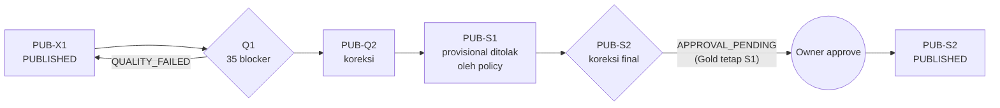
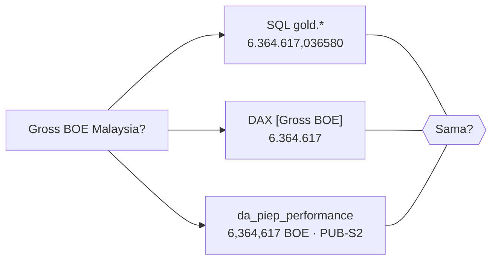

# Lab 13 - Bukti SSOT dan failure drill

Lab terakhir membuktikan janji SSOT dengan skenario yang sengaja dibuat sulit:

- data rusak harus **diblokir**;
- laporan provisional yang bertentangan **tidak boleh** mengganti angka resmi;
- koreksi berwenang hanya berlaku **setelah approval**;
- publikasi lama dapat **direproduksi**;
- semua kanal (SQL, Power BI, dan data agent) menjawab **angka yang sama**.

Dalam lab ini Anda akan:

- [ ] Menjalankan drill kualitas `Q1` → `Q2` dan memastikan Gold tidak tersentuh data rusak.
- [ ] Membuktikan source authority (`S1`) dan koreksi yang disetujui (`S2`).
- [ ] Mereproduksi angka publikasi sebelumnya dengan time travel Warehouse.
- [ ] Menjalankan evaluasi 24 kasus data agent dan membandingkan angka lintas kanal.

## Prasyarat

- Lab 08–12 selesai. Publikasi aktif: `PUB-X1`, termasuk batch express `H1` dan `X1` dari Lab 10.
- Pipeline publikasi sudah memiliki aktivitas refresh semantic model (Lab 09) dan serving AI (Lab 11).

## Peta drill



## 1. Drill kualitas Q1: data rusak diblokir (T08, T16)

1. Muat dan jalankan `Q1`:

   ```powershell
   python -m workshop load --config config/local.json --batch Q1
   ```

   Jalankan `pl_piep_e2e` dengan `p_batch_id = Q1`.
2. Pipeline **gagal** di `fail_quality_gate`. Pesannya menyebutkan bahwa Gold tidak berubah.
3. Di `wh_piep_gold`, jalankan query berikut:

   ```sql
   SELECT PublicationId, Status, BlockerCount, InfoCount FROM ops.publication WHERE PublicationId = 'PUB-Q1';
   SELECT RuleId, Severity, SUM(IssueCount) AS Issues FROM ops.dq_issue_summary
   WHERE BatchId = 'Q1' GROUP BY RuleId, Severity ORDER BY RuleId;
   SELECT PublicationId FROM ops.vw_current_publication;
   ```

| Pemeriksaan | Hasil yang diharapkan |
|---|---|
| `PUB-Q1` | `QUALITY_FAILED`, `BlockerCount = 35` |
| Issue | R01 = 10, R02 = 20, R03 = 5 (BLOCKER); R10 = 100 (INFO) |
| Publikasi aktif | Tetap **`PUB-X1`**; Gross BOE 23.901.259,782757 |
| Report | Trust banner tetap `PUB-X1` |
| `quarantine.production_observation` di `lh_piep_core` | 35 baris dengan alasan per aturan |

## 2. Koreksi Q2

1. Muat `Q2`, jalankan `pl_piep_e2e`, setujui, lalu jalankan `pl_piep_publish_gold` untuk `PUB-Q2`.
2. Gross BOE kembali ke **23.901.259,782757**, sama dengan `PUB-X1`. Koreksi mengembalikan nilai yang benar, dan quarantine untuk batch berjalan kosong.

## 3. Source authority S1: laporan provisional tidak menggantikan angka resmi (T27)

1. Muat dan jalankan `S1`. Kandidat `PUB-S1` berstatus `APPROVAL_PENDING`.
2. **Sebelum approval**, tinjau keputusan sumber yang di-*stage*:

   ```sql
   SELECT WellId, BusinessDate, Commodity, DecisionStatus, SelectedSourceSystem, SelectedValueStd,
          CandidateCount, Reason, CandidatesJson
   FROM stg.source_decision
   WHERE PublicationId = 'PUB-S1' AND WellId = 'MY_B_W001';
   ```

   | Kolom | Nilai yang diharapkan |
   |---|---|
   | `DecisionStatus` | `SELECTED` |
   | `SelectedSourceSystem` | `SRC_MY_PROD` |
   | `SelectedValueStd` | 284,014547 |
   | `CandidateCount` | 2 |
   | `CandidatesJson` | Memuat `SRC_MY_OPS` dengan nilai 294,014547 dan status `PROVISIONAL` |

3. Setujui dan publikasikan `PUB-S1`. Total Gross BOE **tidak berubah**.

## 4. Koreksi berwenang S2: berlaku hanya setelah approval (T28, T31)

1. Muat dan jalankan `S2`. Pipeline teknis berhasil dan kandidat berstatus `APPROVAL_PENDING`.
2. Bandingkan kandidat dengan Gold yang berlaku. Ini adalah *business review* sebelum approval.

   ```sql
   SELECT 'stg PUB-S2' AS Version, f.OilBbl
   FROM stg.fact_production_daily AS f JOIN stg.dim_well AS w
     ON w.WellKey = f.WellKey AND w.PublicationId = f.PublicationId
   WHERE f.PublicationId = 'PUB-S2' AND w.WellId = 'MY_B_W001' AND f.DateKey = 20250920
   UNION ALL
   SELECT 'gold ' + f.PublicationId, f.OilBbl
   FROM gold.fact_production_daily AS f JOIN gold.dim_well AS w ON w.WellKey = f.WellKey
   WHERE w.WellId = 'MY_B_W001' AND f.DateKey = 20250920;
   ```

   Hasilnya: `stg PUB-S2 = 289,014547` dan `gold PUB-S1 = 284,014547`. Report dan agent **masih** menampilkan 284,014547 karena kandidat belum disetujui.
3. Setujui dengan komentar yang menjelaskan alasan bisnis:

   ```sql
   EXEC ops.usp_approve_publication 'PUB-S2', 'APPROVE', 'Operator final correction for MY_B_W001 2025-09-20 (+5 bbl)';
   ```

4. Jalankan `pl_piep_publish_gold` untuk `PUB-S2`. Pipeline me-refresh semantic model dan menjalankan `nb_06`.
5. **Refresh ontology** `ont_piep_upstream` secara manual.

| Ukuran | `PUB-S1` | `PUB-S2` | Selisih |
|---|---:|---:|---:|
| Gross BOE total | 23.901.259,782757 | 23.901.264,782757 | **+5** |
| Net WI BOE total | 9.152.307,167249 | 9.152.309,167249 | **+2** |
| Oil MY_B_W001 2025-09-20 | 284,014547 | 289,014547 | +5 |

## 5. Reproduksi publikasi sebelumnya (T30)

1. Jalankan query 1 di [`05_time_travel.sql`](../assets/sql/warehouse/05_time_travel.sql) untuk mendapatkan `TimeTravelTimestamp` `PUB-S1`.
2. Ganti timestamp contoh di query 2 dan 3 dengan nilai tersebut, lalu jalankan.
3. Query time travel mengembalikan `PUB-S1`, `OilBbl = 284,014547`, dan total gross 23.901.259,782757. Query 4 tanpa time travel mengembalikan `PUB-S2`.
4. Lengkapi bukti dengan metadata publikasi:

   ```sql
   SELECT PublicationId, AuthorityPolicyVersion, MappingVersion, KpiContractVersion, DecidedBy, DecidedAtUtc,
          DecisionComment, PublishedAtUtc, SupersededBy
   FROM ops.publication WHERE PublicationId IN ('PUB-S1', 'PUB-S2');
   ```

> [!NOTE]
> Time travel Warehouse memakai retensi default 30 hari. Untuk audit jangka panjang, ID publikasi, manifest, dan histori Silver di Lakehouse tetap menjadi bukti utama.

## 6. Satu hasil lintas kanal dan evaluasi agent (T29, T19–T21)

1. Pastikan `ops.consumer_status` menampilkan `SEMANTIC_MODEL` dan `AI_SERVING` untuk `PUB-S2`, serta `ai.publication` berisi `PUB-S2`.
2. Jalankan ke-24 kasus di [`agent_evaluation_cases.csv`](../assets/agents/agent_evaluation_cases.csv) pada agent yang sesuai. Gunakan **chat baru** untuk setiap putaran. Untuk menjalankan semua kasus secara otomatis terhadap agent yang sudah **Publish**, gunakan:

   ```powershell
   az login
   python -m workshop evaluate-agents --config config/local.json --rounds 3 --output evidence/agent-evaluation.csv
   ```

   Kasus numerik dan ID publikasi dinilai otomatis (`PASS`/`FAIL`). Kasus penjelasan, penolakan, dan pengalihan ditandai `REVIEW` dan harus diperiksa manusia.
3. Isi [`evidence-template.md`](../assets/agents/evidence-template.md), termasuk tabel konsistensi lintas kanal untuk SQL, DAX, dan agent.



## 7. Uji akses (T17)

1. Di semantic model, pilih **View as** role `Country IQ`. Halaman Incident INC-MY-001 harus kosong, karena insiden tersebut ada di Malaysia.
2. Opsional dengan akun kedua: berikan hanya izin **Read** pada `sm_piep_performance`, lalu tambahkan akun tersebut ke role `Country DZ`. Ajukan EV03 ke `da_piep_performance`. Agent tidak boleh mengembalikan angka Malaysia.

## Daftar bukti SSOT

| Tes | Bukti | Status |
|---|---|---|
| T08 Quality Q1/Q2 | `PUB-Q1 QUALITY_FAILED` 35 blocker; Gold tetap `PUB-X1` | ☐ |
| T15 Resume F1 | `already_committed = true`, 0 baris baru (Lab 08) | ☐ |
| T27 Source authority S1 | `SRC_MY_PROD` 284,014547 dipilih; `SRC_MY_OPS` tersimpan di `CandidatesJson` | ☐ |
| T28 Approved correction S2 | Sebelum approval 284,014547; sesudah +5 BOE gross / +2 BOE net WI | ☐ |
| T29 Satu hasil lintas kanal | Tabel konsistensi tanpa selisih | ☐ |
| T30 Reproduksi publikasi | Time travel `PUB-S1` + metadata `ops.publication` | ☐ |
| T31 Approval gate | `APPROVAL_PENDING` tidak mengubah report atau agent | ☐ |

## Bersihkan atau reset

- Untuk mengulang workshop dari awal, ikuti [cleanup.md](../cleanup.md#reset-untuk-mengulang).
- Untuk menghapus semua resource, ikuti [cleanup.md](../cleanup.md#hapus-semua-resource).

## Referensi

- [Query using time travel at the statement level](https://learn.microsoft.com/fabric/data-warehouse/how-to-query-using-time-travel)
- [Time travel in Fabric Data Warehouse](https://learn.microsoft.com/fabric/data-warehouse/time-travel)
- [Row-level security (RLS) with Power BI](https://learn.microsoft.com/fabric/security/service-admin-row-level-security)
- [Evaluate your data agent](https://learn.microsoft.com/fabric/data-science/evaluate-data-agent)
