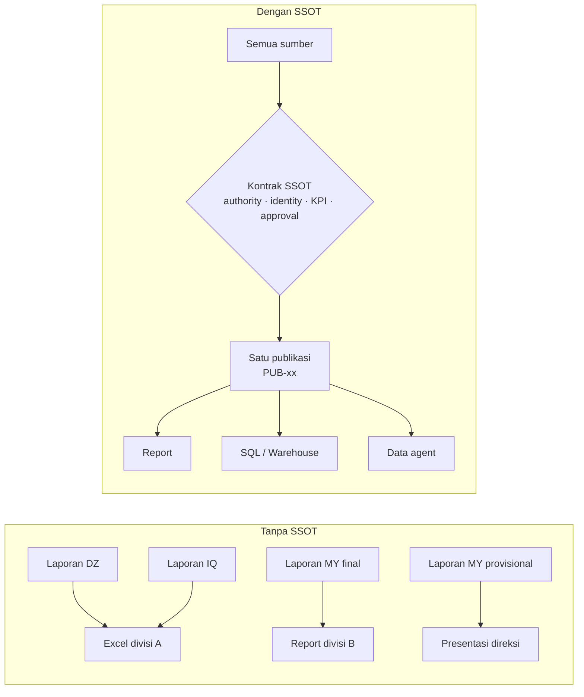
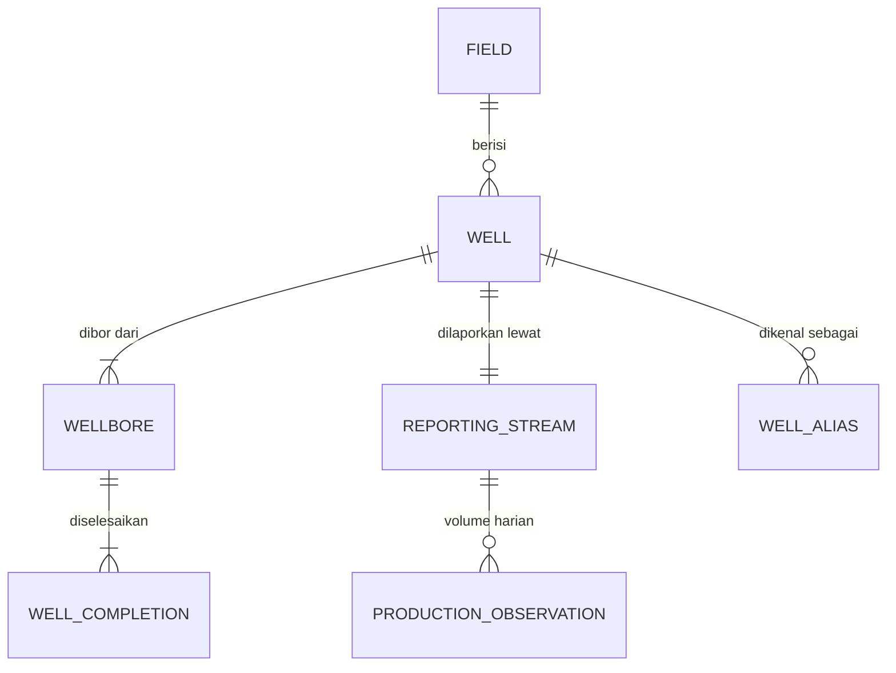
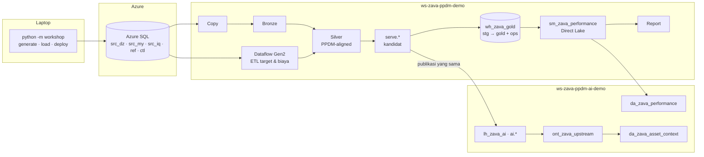
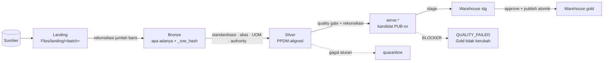
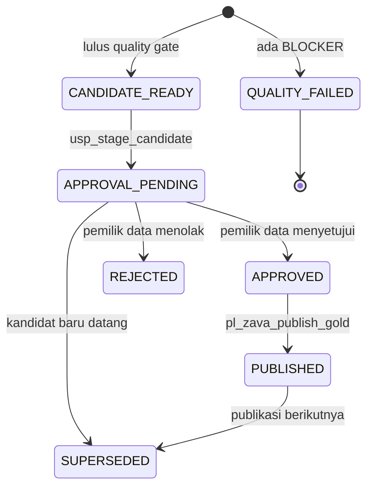
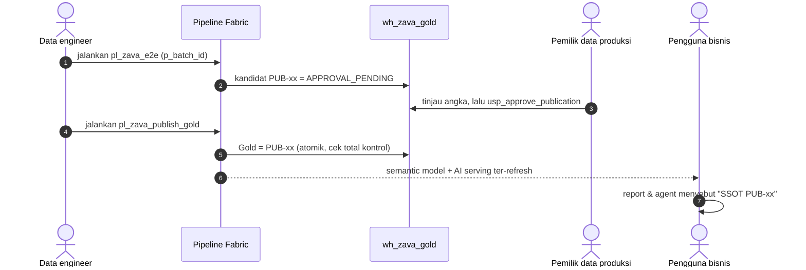
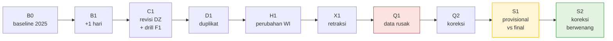
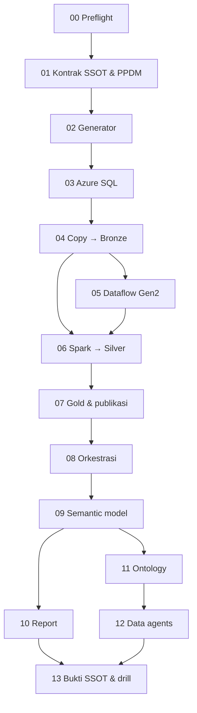

# Overview - Zava Energy Single Source of Truth di Microsoft Fabric

Baca halaman ini sebelum memulai [Lab 00](00-preflight.md). Halaman ini menjelaskan **masalah bisnis** yang diselesaikan workshop, **arsitektur** yang akan dibangun, **alur data**, dan **cara membaca lab**, sehingga setiap langkah teknis punya konteks.

> [!IMPORTANT]
> Semua data dalam workshop **sintetis**. Nama lapangan, sumur, operator, harga, dan biaya tidak mewakili aset atau angka Zava Energy yang sebenarnya. Model data **disejajarkan dengan konsep publik PPDM** (*PPDM-aligned*), bukan salinan skema resmi PPDM.

## 1. Konteks bisnis

Zava Energy, perusahaan hulu migas fiktif dalam workshop ini, mengelola aset hulu di beberapa negara. Setiap aset dilaporkan oleh operator dan sistem yang berbeda. Akibatnya muncul tiga masalah klasik:

| Masalah | Contoh di workshop |
|---|---|
| **Format berbeda** | Aljazair melaporkan minyak dalam m³, Irak melaporkan gas dalam scf dengan nama kolom lokal |
| **Identitas berbeda** | Sumur yang sama dikenal sebagai `MY_B_W001` di sistem final dan `MYB001` di laporan operasi harian |
| **Angka berbeda** | Laporan provisional menyebut 294,014547 bbl, laporan final menyebut 284,014547 bbl untuk sumur dan tanggal yang sama |

Tanpa kesepakatan, setiap divisi memakai angkanya sendiri. **Single Source of Truth (SSOT)** menyelesaikannya dengan kontrak yang jelas, bukan sekadar menaruh semua data di satu tempat.

## 2. Empat janji SSOT yang dibuktikan

| Janji | Artinya | Dibuktikan di |
|---|---|---|
| **Satu identitas** | Setiap sumur punya satu *golden ID*; alias sumber dipetakan, bukan diduplikasi | Lab 01, 06, 11 |
| **Satu sumber berwenang per domain** | Aturan *source authority* memilih angka resmi, dan semua kandidat disimpan sebagai bukti | Lab 01, 06, 13 (S1) |
| **Satu definisi KPI** | Gross BOE, Net WI BOE, completeness, dan loss dihitung sekali di semantic model | Lab 09, 10, 12 |
| **Satu versi publikasi yang dapat ditelusuri** | Angka hanya berubah setelah lulus *quality gate* dan disetujui pemilik data; versi lama bisa direproduksi | Lab 07, 08, 13 |

## 3. Peran PPDM

[PPDM](https://ppdm.org/) adalah standar industri untuk manajemen data hulu migas. Workshop ini **tidak** mengimplementasikan PPDM 3.9 secara penuh. Workshop mengambil konsep publiknya, terutama hierarki *well → wellbore → completion* dan identitas sumur, lalu mencatat batas klaimnya di [register alignment](../assets/contracts/ppdm_alignment_register.csv).

| Status alignment | Contoh |
|---|---|
| `ALIGNED_TO_PUBLIC_CONCEPT` | well, wellbore, completion, alias sumur, satuan |
| `DEMO_EXTENSION` | working interest sederhana, target RKAP, biaya, source authority |
| `REQUIRES_DOMAIN_VALIDATION` | klasifikasi downtime |

## 4. Arsitektur yang dibangun

| Komponen Fabric | Peran dalam SSOT | Lab |
|---|---|---|
| Data Factory (Copy, pipeline) | Menyalin sumber secara teraudit dan mengorkestrasi gate | 04, 08 |
| Dataflow Gen2 | ETL untuk data berformat bisnis (target bulanan, biaya + kurs) | 05 |
| Lakehouse + Spark | ELT: standardisasi, golden record, *source authority*, quality rules | 06 |
| Warehouse | Gold yang hanya berisi publikasi yang disetujui, plus jejak audit | 07 |
| Semantic model (Direct Lake) | Satu definisi KPI dan RLS | 09 |
| Power BI report | Konsumsi bisnis dengan *trust banner* | 10 |
| Fabric IQ ontology | Hubungan antar-objek bisnis untuk AI | 11 |
| Data agent | Tanya-jawab bahasa alami yang tetap tunduk pada SSOT | 12 |

## 5. Medallion dan quality gate

- **Bronze** bersifat *append-only* dan idempoten. Menjalankan ulang batch yang sama tidak menambah baris.
- **Silver** selalu dibangun untuk batch terakhir yang sudah di-*commit*.
- **Quality gate** memakai aturan di [`dq_rules.csv`](../assets/contracts/dq_rules.csv). Issue `BLOCKER` menghentikan publikasi, sedangkan `WARNING` dan `INFO` dicatat sebagai bukti.
- **Gold** hanya berubah lewat prosedur `ops.usp_publish_publication` setelah approval.

## 6. Siklus publikasi

Setiap batch sumber menjadi kandidat publikasi `PUB-<batch>`. Dari situ, kandidat bisa gagal di quality gate, digantikan kandidat baru, ditolak, atau disetujui lalu dipublikasikan.

Siapa melakukan apa:

## 7. Alur cerita data: 10 batch

Generator membuat sepuluh paket batch yang diproses berurutan. Setiap batch mewakili kejadian bisnis yang menguji satu aspek SSOT.

| Batch | Pertanyaan yang dijawab | Hasil yang diharapkan |
|---|---|---|
| B0 | Apakah baseline lengkap dan terekonsiliasi? | `PUB-B0` = 23.840.575,796184 BOE gross |
| B1 | Apakah data incremental masuk tanpa mengubah histori? | +1 hari, 43.920 stream-day |
| C1 | Apakah revisi berwenang diterapkan? Bisakah pipeline pulih setelah gagal? | Total DZ berubah; rerun tanpa duplikasi Bronze |
| D1 | Apakah pengiriman ganda dihitung ganda? | Tidak; tercatat sebagai INFO R10 = 100 |
| H1 | Apakah perubahan working interest berlaku sesuai tanggal? | Net WI turun, gross tetap |
| X1 | Apakah pembatalan data sumber dihormati? | 3 stream-day tidak lengkap |
| Q1 | Apakah data rusak bisa lolos ke Gold? | **Tidak**: 35 blocker, Gold tetap `PUB-X1` |
| Q2 | Apakah koreksi memulihkan publikasi? | Total kembali seperti X1 |
| S1 | Angka mana yang resmi bila dua laporan berbeda? | Final 284,014547 bbl, provisional tersimpan sebagai bukti |
| S2 | Kapan koreksi resmi berlaku? | Hanya setelah approval: +5 BOE gross, +2 BOE net WI |

Fixture insiden **INC-MY-001** ada sejak B0: gangguan production manifold selama 4 hari yang memengaruhi 10 sumur, dengan kehilangan 4.000 BOE gross, 1.600 BOE net WI, dan USD 177.080. Angka ini dipakai untuk menguji report, SQL, ontology, dan data agent.

Semua angka acuan ada di [kunci jawaban](../assets/expected/expected-results-standard.json).

## 8. Peta lab

| Bagian | Lab | Fokus | Durasi |
|---|---|---|---:|
| Fondasi | 00–03 | Lingkungan, kontrak, data sintetis, sumber | ±3,5 jam |
| Rekayasa data | 04–08 | Ingestion, ETL/ELT, Gold, orkestrasi | ±6,5 jam |
| Konsumsi | 09–12 | Semantic model, report, ontology, agent | ±5 jam |
| Pembuktian | 13 | Drill kualitas, authority, time travel, evaluasi agent | ±1 jam |

Setiap lab mengikuti format Microsoft Learn: tujuan, prasyarat, langkah bernomor, **verifikasi dengan angka yang diharapkan**, pemecahan masalah, langkah berikutnya, dan referensi.

## 9. Dua jalur jaringan untuk sumber

Pilih jalur sebelum Lab 03. Keduanya sudah diuji end-to-end.

| | Opsi A - endpoint publik | Opsi B - jaringan privat |
|---|---|---|
| Kapan dipakai | Tenant mengizinkan akses publik Azure SQL | Kebijakan organisasi menonaktifkan akses publik |
| Akses Fabric ke SQL | Koneksi cloud | VNet data gateway + private endpoint |
| Memuat data | `python -m workshop load` dari laptop | Pipeline `pl_zava_load_source` dari OneLake |
| Kapasitas | Trial cukup untuk Lab 00–11 | Butuh kapasitas F berbayar (gateway) |

Detail ada di [Lab 03](03-azure-sql-source.md#opsi-b---jaringan-privat-tanpa-endpoint-publik).

## 10. Peran peserta

| Peran | Tanggung jawab | Lab utama |
|---|---|---|
| Data engineer | Ingestion, notebook, Dataflow, pipeline, staging | 03–08 |
| Pemilik data produksi | Meninjau kandidat dan menyetujui atau menolak publikasi | 07, 08, 13 |
| BI/AI analyst | Semantic model, report, ontology, agent, evaluasi | 09–13 |

Dalam kelas mandiri, satu peserta memegang semua peran. Dalam kelompok, peran dapat dibagi; lihat [panduan fasilitator](../facilitator-guide.md).

## 11. Yang perlu disiapkan

- Akun Microsoft Entra dengan akses Fabric dan subscription Azure.
- Kapasitas Fabric: Trial cukup untuk sebagian besar lab; **data agent dan VNet data gateway membutuhkan kapasitas F berbayar** (F2 atau lebih untuk agent).
- Pengaturan tenant untuk ontology dan data agent (dicek di Lab 00).
- Laptop dengan Python 3.11+, ODBC Driver 18, dan Azure CLI.

## 12. Istilah penting

| Istilah | Arti dalam workshop |
|---|---|
| **Batch** | Satu paket perubahan sumber yang dimuat dan disegel (`SEALED`) di Azure SQL |
| **Golden ID** | ID sumur kanonis, misalnya `MY_B_W001` |
| **Reporting stream** | Unit pelaporan produksi harian per sumur |
| **Source authority** | Aturan yang menentukan sumber mana yang berwenang per domain, negara, dan status |
| **Candidate / kandidat** | Hasil `serve.*` untuk satu `PublicationId` yang belum disetujui |
| **Publication / publikasi** | Versi Gold yang sudah disetujui, misalnya `PUB-S2` |
| **Quality gate** | Pemeriksaan aturan kualitas; `BLOCKER` menghentikan publikasi |
| **Gross BOE** | Oil (bbl) + Gas (Mscf) / 6 |
| **Net WI BOE** | Gross BOE × working interest pada tanggal bisnis (bukan entitlement fiskal) |
| **Trust banner** | Kartu di report yang menampilkan ID publikasi, approver, dan waktu publikasi |

## Langkah berikutnya

> [!div class="nextstepaction"]
> [Lab 00 - Preflight lingkungan](00-preflight.md)

## Referensi

- [What is Microsoft Fabric?](https://learn.microsoft.com/fabric/fundamentals/microsoft-fabric-overview)
- [Implement medallion lakehouse architecture in Microsoft Fabric](https://learn.microsoft.com/fabric/onelake/onelake-medallion-lakehouse-architecture)
- [Direct Lake overview](https://learn.microsoft.com/fabric/fundamentals/direct-lake-overview)
- [Fabric data agent concepts](https://learn.microsoft.com/fabric/data-science/concept-data-agent)
- [PPDM - What Is A Well? components](https://whatisawell.ppdm.org/components)
- Dokumen konteks: [Rencana demo](../../DEMO_PLAN_ZAVA_ENERGY_PPDM_MICROSOFT_FABRIC_END_TO_END.md) · [PPDM Association](https://ppdm.org/)
